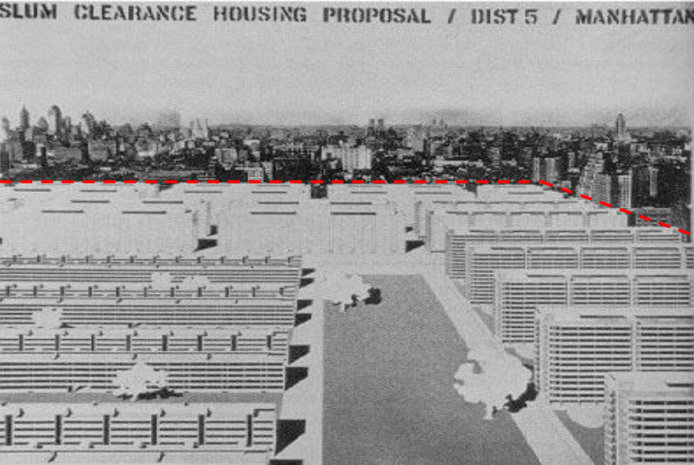
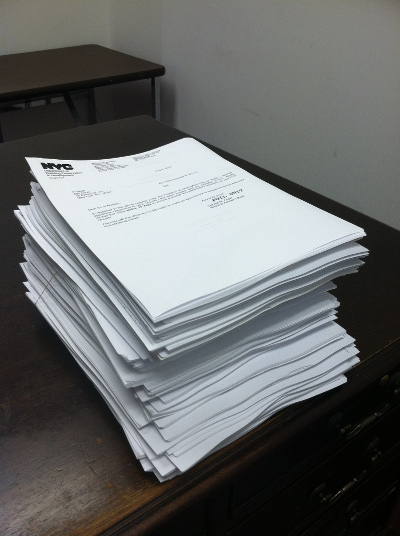
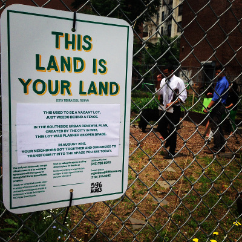

# About

Neighborhood master plans - often called “urban renewal plans” - were adopted to get federal funding for acquiring land, relocating the people living there, demolishing the structures and making way for new public and private development. Plan adoptions started in 1949 and many plans remain active today. Development in the plan areas sometimes happened, like Lincoln Center, and sometimes didn't, like many still-vacant lots in East New York and Bushwick. Areas were selected for renewal because they were considered blighted or obsolete. The "blight" designation always came from outside the communities that got that label - from inspectors working for the mayor’s Committee on Slum Clearance in the early period and Housing Preservation and Development (HPD) employees in the later period. 

596 Acres has teamed up with Partner & Partners and SmartSign to produce a comprehensive online map [showing all the adopted neighborhood master plans](http://www.nyc.gov/html/hpd/html/developers/urban-renewal.shtml) for New York City. It has taken us nearly two years to follow up on a [Freedom of Information Law request](media/596URPFOILletter_take2.pdf) for records of those plans and meticulous translation of paper plans into machine-readable spreadsheets to make this map. 
 
The plans were written with a great city in mind. Huge swaths were designated for demolition, to be paid for with federal dollars. Lots that were designated this way to justify the funding for demolition had to be included in a plan that stated what they "should" be - designations like "housing," "industrial," and "open space."

*Image manipulated by Andrew Tucker.*

## Methodology

These plans have existed in paper form in HPD's offices, but have been inaccessible to the public until now. Our request for access to the agency records was granted in 2012 and we opted for the right to inspect these records instead of having the agency make copies for us at 25 cents per page. Our team of trained volunteer records inspectors examined each plan and listed all the lots that were included in it, including the dispositions that were promised where those were available. These volunteers spent over 100 hours inspecting the records. A few plans were completely missing from the stacks that HPD provided, so our research team looked for them in community archives and on the internet.

*Photo by Paula Z. Segal.*

Every property in the city has a specific number assigned to it - a borough, block and lot number (BBL). The BBLs created using the above process were mappable (using [MapPLUTO](http://www.nyc.gov/html/dcp/html/bytes/dwn_pluto_mappluto.shtml#mappluto)) only where they did not change since the plan was adopted. Many plans or other developments changed these numbers, for example, when a number of small lots were merged to become a larger lot.

In order to map those places where the BBL changed, we used the City's [Library of Tax Maps](http://gis.nyc.gov/taxmap/library.htm) to find historic maps of the blocks in question and determine which lots they had become. Where we were unable to find a lot in the Library of Tax Maps, we consulted the most recently-published compendia of urban renewal maps - an [atlas from 1984](http://www.worldcat.org/title/atlas-of-urban-renewal-project-areas-in-the-city-of-new-york/oclc/10819767&referer=brief_results) and a [progress report from 1968](http://www.worldcat.org/title/community-development-program-progress-report/oclc/10551321&referer=brief_results). By looking at the outlines of the impacted areas in those books we were able to identify which modern lots were actually the ones impacted by the plans. This process let us capture every lot that was designated for "renewal."

Where we could, we also captured what form that renewal was meant to take in the form of "dispositions." Our map lets you search for lots that were designated for “open space,” “residential” or “commercial” uses. Only some plans were this detailed, so not every lot has a specific designation. For example, some plans grouped numerous potential uses such as "housing, commercial, open space" as a disposition for a lot. Where this was the case, our tool doesn't show a specific disposition for the lot, and the lot won't show up in the highlighted lot view.

## Outcomes

One of the reasons we are excited to be making the plans accessible is that they include places that were cleared with the intention of creating open public spaces. In our work through [596 Acres](http://596acres.org/), we have already found two and helped neighbors transform them into something better: 

*Sign designed by Partner & Partners. Photo by Paula Z. Segal.*
 
- The Keap Fourth Community Garden in South Williamsburg was a vacant lot two years ago that we noticed was part of an Urban Renewal Plan and designated to be Open Space. The 596 Acres team put signs on it and helped folks get together and they got no resistance from the relevant agencies. It has been transferred to Parks and there was a formal ribbon cutting on June 4, 2014, more than 20 years after the lot was planned as Open Space.

- The Edgemere Urban Renewal Plan (Queens) contains dozens of lots planned as Open Space. Last year, we put signs on the set of the lots that was designated as the Edgemere Urban Renewal Park in the plans. Today, neighbors who saw these signs are running the [Edgemere Farm](http://596acres.org/en/lot/4158370033/).

## Our Team

**Eric Brelsford**, [596 Acres](http://596acres.org/)

**Blair Brewster**, [SmartSign](http://www.smartsign.com/)

**Charles Chawalko** performed digital cartography and data corrections in the production and visualization of the map. His interest in the project came from his own thesis work and struggle concerning the potential privatization of his Mitchell-Lama cooperative that was born out of the Brooklyn Bridge Southwest Urban Renewal Plan. It is with hope in unveiling these hidden histories associated with urban renewal plans that we can secure spaces while creating new futures for them.

**Matt Delsesto** has been working on this data liberation mission since the summer of 2013 when he first encountered the overwhelming stack of urban renewal plans on the 6th floor of Housing Preservation and Development offices.  He became excited when he recognized streets on pieces of paper in the windowless room, and learned that if we think our neighborhoods are missing pieces, it's because they probably are.

**Greg Mihalko**, [Partner & Partners](http://partnerandpartners.com/), is the designer on the project, working on graphic and interaction design for the website and identity. He’s excited to visualize how the city has been planned, built and shaped into what it is today.

**Zach Mihalko**, [Partner & Partners](http://partnerandpartners.com/)

**Paula Z. Segal**, [596 Acres](http://596acres.org/), is the founding director of 596 Acres. For many years, she lived in a neighborhood full of holes in North Brooklyn. Now, she’s doing something about it. 

**Merran Swartwood** joined the project in November 2013 as a data-gathering robot and became part of the website team, to which she contributed much discussion and some copywriting. She misses the weekly security checks at the Department of Housing Preservation and Development and the monthly pies at 596 Acres.