# Archive

In this archive you can find documentation of talks, discussions, film screenings, tours, and other events that took place as part of or relating to the Urban Reviewer. In the past, two major presentations of the Urban Reviewer took place at the **Queens Museum (“Reviewing Renewal”)** in early 2015 and as part of **Spontaneous Interventions on Governor’s Island** in summer 2014. 

## Reviewing Renewal

<iframe width="560" height="315" src="https://www.youtube.com/embed/A8xPMS-hzxU" frameborder="0" allowfullscreen></iframe>

From **January 11 to February 8, 2015**, the Urban Reviewer came to life as an intervention on the Panorama of the City of New York at the **Queens Museum** for **Reviewing Renewal**. We put all 155+ Urban Renewal Area Plans that NYC ever adopted on the Panorama, with accompanying programs every Sunday and wall treatments that invited visitors to see and shape urban renewal in our city. For more information on the exhibition, including a full program of related events, please visit [596 Acres](http://596acres.org/news/2014/12/23/596-acres-presents-the-urban-reviewer-on-the-queens-museum-panorama/). 

For Reviewing Renewal, we also created the first ever printed atlas of Urban Renewal Area Planning 1949-2015. You can download it [here](http://www.urbanreviewer.org/media/QueensMuseum_Broadsheet_ReviewingRenewal.pdf). 

Click on VIDEOS & AUDIO in the menu the left to see complete documentation of the programs. 

Curator: Paula Z. Segal, Esq., 596 Acres, Inc.
Exhibition Design: Mary Bereschka, Greg Mihalko, Stephan von Muehlen 
Design: Partner & Partners
Event Production: Amy Fitzgerald, Oksana Mironova
Documentation: Badrul Hisham Ismail, Christina Sukhgian Houle, Molly Garfinkel (City Lore) 

## Spontaneous Interventions

We experimented with bringing the Urban Reviewer into a physical space for the first time during **596 Acres' residency on Governor's Island** as part of **Spontaneous Interventions** in summer 2014. For more information, please visit [Spontaneous Interventions' website](http://www.spontaneousinterventions.org/).

## Videos

**Reviewing Renewal: A Willet’s Point Walk**  with [Dr. Jack Eichenbaum](http://www.geognyc.com/?page_id=9), Queens Borough Historian @ Queens Museum, Sat, January 11, 2015

<iframe width="560" height="315" src="https://www.youtube.com/embed/-mxOUe7Quw8" frameborder="0" allowfullscreen></iframe>

A walking tour of the Willets Point Urban Renewal Area with Dr. Jack Eichenbaum, Queens Borough Historian. East of Citifield (the New York Mets baseball stadium) is a sewerless hardscrabble area of auto junkyards and related businesses that has twice beaten back attempts at redevelopment. But as it is located between the new stadium and a booming Chinatown in Flushing, public and private interests are again trying to transform “Willets Point.” _For more information on this event, please visit [596 Acres' website](http://596acres.org/news/2014/12/23/596-acres-presents-the-urban-reviewer-on-the-queens-museum-panorama/)._

**Reviewing Renewal: Adam Purple and the Garden of Eden** 
by Harvey Wang and Amy Brost

<iframe src="https://player.vimeo.com/video/29275235" width="560" height="315" frameborder="0" webkitallowfullscreen mozallowfullscreen allowfullscreen></iframe>  

In 1975, on the crime-ridden Lower East Side, Adam Purple started a garden behind his tenement home. By 1986, The Garden of Eden was world famous and had grown to 15,000 square feet. For Adam – a social activist, philosopher, artist, and revolutionary – the Garden was the medium of his political and artistic expression. It was razed by the city in 1986 after a protracted court battle. This film documents the creation of this artwork and its ultimate destruction.  Winner of the "Neighborhood Award" at the Lower East Side Film Festival.

**Reviewing Renewal: On the Model and Modelling** 
with Peter Richardson, [Mapzen](https://mapzen.com/) @ Queens Museum, Sat, January 11, 2015  _For more information on this event, please visit [596 Acres' website](http://596acres.org/news/2014/12/23/596-acres-presents-the-urban-reviewer-on-the-queens-museum-panorama/)_  
  
<iframe width="560" height="315" src="https://www.youtube.com/embed/u6VUZDtGhBE" frameborder="0" allowfullscreen></iframe>

**Reviewing Mitchell Lama: The Past, Present and Future of Affordable Housing in NYC**   hosted by the Planners Network NYC, with Charles Chawalko, Jackie Peters, Alexis Smallwood, and moderated by Katie Goldstein @ Queens Museum, Sat, January 18, 2015. Recorded by Molly Garfinkel, [City Lore](http://citylore.org/).  

<iframe width="560" height="315" src="https://www.youtube.com/embed/9oaIKDIZeE0" frameborder="0" allowfullscreen></iframe>  

Planners Network NYC hosted a discussion on the past, present and future of the Mitchell Lama program, one of New York's most important and embattled affordable housing initiatives. _For more information on this event, please visit [596 Acres' website](http://596acres.org/news/2014/12/23/596-acres-presents-the-urban-reviewer-on-the-queens-museum-panorama/)._

**Reviewing Renewal: The Manhattan Projects Tour**   by Samuel Zipp @ Queens Museum, Sat, January 25, 2015  
<iframe width="560" height="315" src="https://www.youtube.com/embed/5Ul1rCDhJrk" frameborder="0" allowfullscreen></iframe>  
“Around the city” tour of four completed NYC urban renewal projects (United Nations, Stuyvesant Town, Lincoln Square/Center, East Harlem) on the panorama with Samuel Zipp, author of _Manhattan Projects: the Rise and Fall of Urban Renewal in Cold War New York_. _For more information on this event, please visit [596 Acres' website](http://596acres.org/news/2014/12/23/596-acres-presents-the-urban-reviewer-on-the-queens-museum-panorama/)._

**Reviewing Renewal: Before Lincoln Center**   with Jennifer Hock and Mariana Mogilevich, organized by Oksana Mironova, @ Queens Museum, Sat, January 25, 2015  
<iframe width="560" height="315" src="https://www.youtube.com/embed/oaxaZ9ZnqE4" frameborder="0" allowfullscreen></iframe>  
<iframe width="560" height="315" src="https://www.youtube.com/embed/AviAOEJY8I8" frameborder="0" allowfullscreen></iframe>  
<iframe width="560" height="315" src="https://www.youtube.com/embed/Na2oQ32YpOw" frameborder="0" allowfullscreen></iframe>  
<iframe width="560" height="315" src="https://www.youtube.com/embed/EHWfzeNU8Uo" frameborder="0" allowfullscreen></iframe>  
Screenings of films Rompierdo Puertas (Break and Enter) (1971) & The Case against Lincoln Center (1968), both from Third World Newsreel, framed and followed a discussion with Jennifer Hock and Mariana Mogilevich on the city-facilitated transformation of the Upper West Side. _For more information on this event, please visit [596 Acres' website](http://596acres.org/news/2014/12/23/596-acres-presents-the-urban-reviewer-on-the-queens-museum-panorama/)._

**Reviewing Renewal: Queens**   with Dr. [Jack Eichenbaum](http://www.geognyc.com/?page_id=9 ) and Kalin Callaghan @ Queens Museum, Sat, January 25, 2015  
<iframe width="560" height="315" src="https://www.youtube.com/embed/ixxZtCgEGz4" frameborder="0" allowfullscreen></iframe>  
with Queens Borough Historian Dr. Jack Eichenbaum, Kalin Callaghan of the United Peninsula Working to Achieve Responsible Development (UPWARD) coalition in Rockaway and others to be announced. _For more information on this event, please visit [596 Acres' website](http://596acres.org/news/2014/12/23/596-acres-presents-the-urban-reviewer-on-the-queens-museum-panorama/)._

**Reviewing Renewal: What happens to a neighborhood “renewed?”**   with Marci Reaven, Damaris Reyes, Joel Feingold, Gabrielle Bendiner-Viani, and the Layered SPURA / City Studio @ Queens Museum, Sat, February 1, 2015  
<iframe width="560" height="315" src="https://www.youtube.com/embed/-ANv5NlDz8U?t=1m50s" frameborder="0" allowfullscreen></iframe>  
Strategies, tactics and tools of community participation in response to urban renewal. Historian Marci Reaven, on the role of community planning boards and people’s plans, with activists from the contested Seward Park Urban Renewal Area on Manhattan’s Lower East Side, Gabrielle Bendiner-Viani and the Layered SPURA / City Studio project from the New School. _For more information on this event, please visit [596 Acres' website](http://596acres.org/news/2014/12/23/596-acres-presents-the-urban-reviewer-on-the-queens-museum-panorama/)_

**Reviewing Renewal: Urban Renewal is Scapegoated to Justify Current Conditions of Spatial Domination**   an artist’s walk & talk with Damon Rich @ Queens Museum, Sat, February 1, 2015  
<iframe width="560" height="315" src="https://www.youtube.com/embed/zhBjtbdg15M" frameborder="0" allowfullscreen></iframe>  
_For more information on this event, please visit [596 Acres' website](http://596acres.org/news/2014/12/23/596-acres-presents-the-urban-reviewer-on-the-queens-museum-panorama/)._

**Reviewing Renewal: From Redlining to Gentrification**   program by the University of Orange with Dr. Mindy Fullilove, Molly Rose Kaufman, Rod Wallace, Havanna Fisher, and Aubrey Murdock @ Queens Museum, Sat, February 1, 2015  _For more information on this event, please visit [596 Acres' website](http://596acres.org/news/2014/12/23/596-acres-presents-the-urban-reviewer-on-the-queens-museum-panorama/)._  
<iframe width="560" height="315" src="https://www.youtube.com/embed/JBHDYO5BZTE" frameborder="0" allowfullscreen></iframe>  

This program inspired the participants to create _The Domino Effect_. Watch it here, too!   
<iframe src="https://player.vimeo.com/video/126115082" width="560" height="315" frameborder="0" webkitallowfullscreen mozallowfullscreen allowfullscreen></iframe>   

## Audio

**Reviewing Renewal: “Who Makes A Neighborhood?”**  a reading by author DW Gibson @ Queens Museum, Sat, January 11, 2015  _For more information on this event, please visit [596 Acres' website](http://596acres.org/news/2014/12/23/596-acres-presents-the-urban-reviewer-on-the-queens-museum-panorama/)._
<iframe width="100%" height="166" scrolling="no" frameborder="no" src="https://w.soundcloud.com/player/?url=https%3A//api.soundcloud.com/tracks/192441338&amp;color=ff5500&amp;auto_play=false&amp;hide_related=false&amp;show_comments=true&amp;show_user=true&amp;show_reposts=false"></iframe>  
DW Gibson is the author of The Edge Becomes the Center: An Oral History of 21st Century Gentrification. His work has appeared in such publications as The New York Times, The Washington Post,The Daily Beast, The Village Voice, and The Caravan. He has been a contributor to NPR’s All Things Considered and is the director of the documentary, Not Working. www.dwgibson.net

## Photos

**Reviewing Renewal at the Queens Museum** 

* [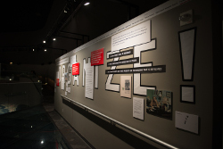](img/archive/RR_1.jpg)
* [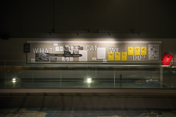](img/archive/RR_2.jpg)
* [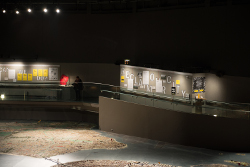](img/archive/RR_3.jpg)
* [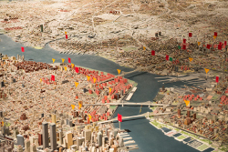](img/archive/RR_4.jpg)
* [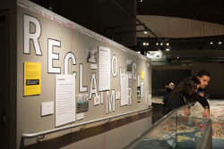](img/archive/RR_5.jpg)
* [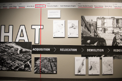](img/archive/RR_6.jpg)
* [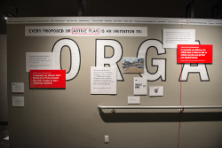](img/archive/RR_7.jpg)  

_To view more photos from each programming day, please select: 

[January 11 (opening day)](http://596acres.org/en/photos/album/53/), [January 18](http://596acres.org/en/photos/album/54/), [January 25](http://596acres.org/en/photos/album/55/), [February 1](http://596acres.org/en/photos/album/56/), [February 8 (closing day)](http://596acres.org/en/photos/album/57/)._

**Urban Reviewer at Spontaneous Interventions on Governor's Island** 

* [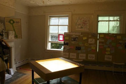](img/archive/SI_1.jpg)
* [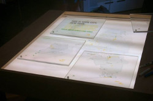](img/archive/SI_2.jpg)
* [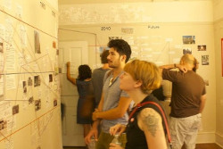](img/archive/SI_3.jpg)
* [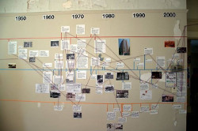](img/archive/SI_4.jpg)

_To view more photos from the residency at Spontaneous Interventions, please visit [596 Acres' website](http://596acres.org/en/photos/album/52/)._

This work is licensed under a <a rel="license" href="http://creativecommons.org/licenses/by-nc-sa/4.0/">Creative Commons Attribution-NonCommercial-ShareAlike 4.0 International License</a>.
