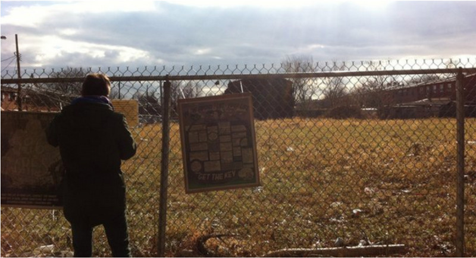
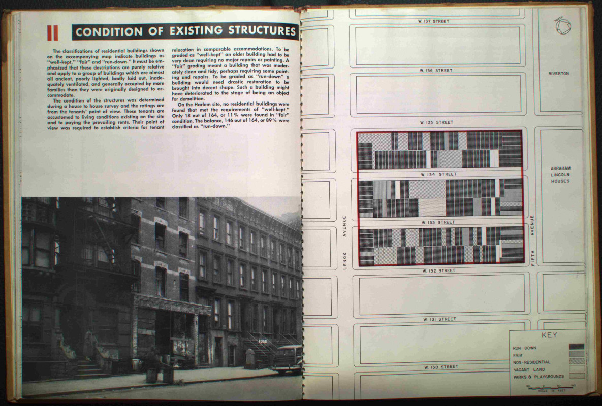
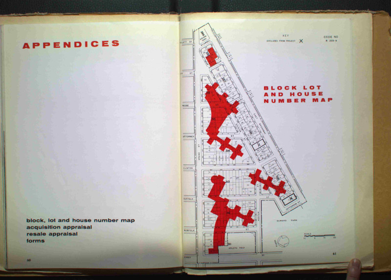
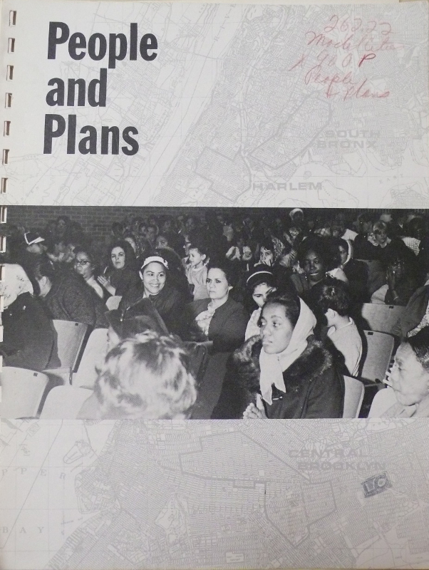

# Archive

In this archive you can find documentation of talks, discussions, film screenings, tours, and other events that took place as part of or relating to the Urban Reviewer. In the past, two major presentations of the Urban Reviewer took place at the **Queens Museum (“Reviewing Renewal”)** in early 2015 and as part of **Spontaneous Interventions on Governor’s Island** in summer 2014. 

## Reviewing Renewal

From **January 11 to February 8, 2015**, the Urban Reviewer came to life as an intervention on the Panorama of the City of New York at the **Queens Museum** for **Reviewing Renewal**. We put all 155+ Urban Renewal Area Plans that NYC ever adopted on the Panorama, with accompanying programs every Sunday and wall treatments that invited visitors to see and shape urban renewal in our city. For more information on the exhibition, including a full program of related events, please visit the [Queens Museum’s website](http://www.queensmuseum.org/2015/01/reviewing-renewal). 

Curator: Paula Z. Segal, Esq., 596 Acres, Inc.
Exhibition Design: Mary Bereschka, Greg Mihalko, Stephan von Muehlen 
Design: Partner & Partners
Event Production: Amy Fitzgerald, Oksana Mironova
Documentation: Badrul Hisham Ismail, Christina Sukhgian Houle, Molly Garfinkel (City Lore) 

## Spontaneous Interventions

We experimented with bringing the Urban Reviewer into a physical space for the first time during **596 Acres' residency on Governor's Island** as part of **Spontaneous Interventions** in summer 2014. For more information, please visit [Spontaneous Interventions' website](http://www.spontaneousinterventions.org/).

## Essays

[Model Cities](#model-cities) by by Haja Worley, with editorial support from Cindy Worley

["We could have studied city-making"](#city-making) by Matthew Delsesto

[Qué era y qué es la renovación urbana en Nueva York? / What Was, And What Is, Urban Renewal in New York City?](#what-was-what-is) by Mariana Mogilevich

[Who Makes A Neighborhood?](#who-makes-neighborhood) by DW Gibson

### Model Cities

by Haja Worley, with editorial support from Cindy Worley

_In 1966 Congress approved the Model Cities Act, which sought to change how urban renewal took place in American Cities. Part of President Lyndon B. Johnson’s War on Poverty, Model Cities responded to both criticism of how urban renewal had been conducted so far and the growing problems in the country’s inner cities, which by then had let to a series of summer “riots.” Designed to spur comprehensive renewal in some of the most troubled urban neighborhoods, Model Cities plans were meant to consider the social and economic health of neighborhoods, and not just their physical condition. Education, jobs training, and healthcare would be planned for alongside new housing and community facilities._

_A key feature of Model Cities was its insistence on “widespread citizen participation” in planning—the people who would be affected by urban renewal plans should have a strong hand in shaping them. The Model Cities program, which only lasted until 1973, was overextended, applied to too many cities without enough funding to support them, especially as the Vietnam War escalated and claimed more attention and money. And what funds and programs did develop were fought over by different interest groups, slowing down the process and failing to provide effective participation. But some of the roots of community planning can be found in this planning experiment._

Around 1965 or ’66, the Model Cities Project came to Paterson. A combination of things which  led to riots and rebellion were really the reason Model Cities was developed. People were just tired of the lack of jobs and affordable housing, and they were realizing they didn’t have to be so servile, so accepting of bad conditions.  Dr. King and Malcolm were having an effect on both youth and adults; their influence was opening people’s minds. The Black Power movement was starting to develop on a nationwide scale.

Right after the July ’64 riots, Mayor Frank Graves had approached Washington about funding for jobs and education.  Of course, there had been the 1963 March on Washington before Kennedy’s death—after Kennedy died anger and disenchantment with the status quo escalated.  Authorities realized something had to be done.

It was around then that I began to be involved with the Street Academy - part of  Model Cities. I guess you could say I was a "field Officer."  I found myself attending meetings in schools, churches, Masonic halls, even bars and people’s homes.  We would go to different sites and projects, recruiting young people.  We had a lot of organizational meetings to get people to talk to local business people as well as D.C. - mostly to create jobs.  We talked with religious leaders and high school kids to get them to stay in school; we would network with other cities like Elizabeth, Newark, Jersey City, because all were in a similar situation. 
Pretty much out of all that many programs developed—like the Neighborhood Youth Corps, Manpower-- the Street Academies  came to be known as “Freedom Schools.”  All this was really created as a response to the ongoing insurrection.  Nationwide inner city conditions were all pretty much the same.

Still, many of these programs didn’t really create lasting jobs; they just created more programs which were often temporary—and there was some corruption because people didn’t know how to properly use the programs and the money that came with it.  Business people were so shook up by the riots they were willing to give militants free space just to appease folks, and in some instances people used that fear to get what they wanted for personal gain. For instance, folks were given office space in Riverview Towers in Paterson; they moved into high rises and started wearing fancy clothes, but had no real connection to the people.  A weakness of Model Cities was that it threw money at a problem without having enough people in place who knew how to use the money wisely.

But I guess you could say Model Cities laid the groundwork, in a sense, for programs that came later—like Job Corps, Americorps, Neighborhood Youth Corps, and here in NYC the  City Volunteer Corps (a great program which was unfortunately abandoned in the 90’s). There was a certain continuity in that.  But no real hands-on institutions or change came directly out of Model Cities in Paterson or other New Jersey Cities.  A few small businesses took people on but on a large scale no remedy that was necessary happened.  Paterson, Jersey City and Newark all continued on a downward slide.

So while nothing  immediately tangible - no huge turn-around - came out of Model Cities, nonetheless, I think Model Cities did empower people.  Not perhaps on a grand scale.  But for me personally, for instance, I met and worked with well-known organizers like Junious Williams ,who, after the riot of 1967 in Newark, had become something of a legend for all the organizing he’d been doing with the Office of Equal  Opportunities  in Newark.  Junious was appointed head of Model Cities in Paterson.

And my experiences taught me to have a vision, to pay attention to detail, to consider and weigh possibilities. As I transitioned from Model Cities and Street Academy, I took tools which stuck with me, and which I know later came to bear on what I’ve done and am doing here in NYC, especially as it relates to community gardens and grassroots neighborhood revitalization.  Working here beginning in Brooklyn in the late 70’s  with reclaiming abandoned properties, and then in the 80’s in Harlem starting gardens on vacant lots and getting people involved.  Back in  the 80’s whenever we had a block party we’d call it a “party with a purpose” and get down into those courtyards of abandoned brownstones with shovels and Clorox and clean them out.  Every event had a work component that got folks involved. 

I’ve continued with my work (as a founding member and the first president) of NYCCGC, as well as our continued work with the Joseph Daniel Wilson Memorial Garden here, our annual Harlem Green Community Garden Tour and workshop series, and also my work with the Circle of brothers and the Community Emergency Response Team.   It’s about people taking control of their own lives, and having the wherewithal to do that—whether it’s cleaning up a vacant lot and growing your own food, greening your neighborhood, or being personally ready for any disaster that might come your way.

I do think Model Cities served as a springboard, if you will, to get those of us who longed for something better, to take the bull by the horns, to get involved in something larger than oneself which has a direct bearing on your life and that of those around you.  It gave us the opportunity to envision—and work toward our vision of  a better community.  It gave me  tools to help me realize that I can make a difference. Model Cities is where I first became introduced to the Black Panthers, and then became involved in organizing—I became involved in wanting to build things rather than, as some felt, “burn this mother down,”—I wanted to organize,to build the community up.

I feel strongly about getting young people involved in “building things up” in their communities.  I think we need to harness all that creative energy which often turns into negativity and violence, and get them involved in projects where they can see they’re making a difference—like building urban farms and gardens.  We’ve worked with numerous young people over the years and even the tough guys get inspired when they see what they can accomplish in a community garden.

Presently, I co-host a radio program  called “Harlem 411” on a local community radio station at CUNY here in Harlem.  We cover community events, local, national and international news, and interview people who have information or services of value to offer others.  I rely a lot on making links, “connecting the dots,” so to speak, and using the airwaves to educate, alert and organize.  I also engineer a program called “Inside Housing and Communities,” which covers many facets of urban development.  So in a way things have come full circle.

### “We could have studied city-making”
by Matthew Delsesto

_In the street outside a school  
what the children learn  
possesses them.  
Little boys yell as they stone a flock of bees  
trying to swarm  
between the lunchroom window and an iron grate.  
The boys sling furious rocks  
smashing the windows.  
The bees, buzzing their anger,  
are slow to attack.  
Then one boy is stung  
into quicker destruction  
and the school guards come  
long wooden sticks held out before them  
they advance upon the hive  
beating the almost finished rooms of wax apart  
mashing the new tunnels in  
while fresh honey drips  
down their broomsticks  
and the little boy feet becoming expert  
in destruction  
trample the remaining and bewildered bees  
into the earth._  
  
_Curious and apart  
four little girls look on in fascination  
learning a secret lesson  
and trying to understand their own destruction.  
One girl cries out  
"Hey, the bees weren't making any trouble!"  
and she steps across the feebly buzzing ruins  
to peer up at the empty, grated nook  
"We could have studied honey-making!"_  
- Audre Lorde, “The Bees”  

In 2010, The Boston Redevelopment Authority began an initiative to re-zone Boston neighborhoods for urban agriculture.  The purpose of this was to make urban agriculture a permitted land use in the city, particularly for local commercial farmers to utilize vacant land.  The first pilot project was to be in Dorchester, a Boston neighborhood that is more than one-third African American.  Poverty and vacant land persist in parts of Dorchester, as a legacy of the massive political and economic disinvestment of the 70s and 80s. 

At one of the initial community meetings in Dorchester, there was a small team from the Boston Redevelopment Authority, local leaders from neighborhood organizations, and concerned residents.  A project leader from the Redevelopment Authority delivered a PowerPoint presentation to explain the scope of the project.  This white man told a story that many in the “local food” movement are familiar with—a story about the lack of access to healthy food in poor neighborhoods and the great potential of alternative forms of local food production. The project, he said, was part of a greener Boston for all. 

Despite his enthusiasm, there was a noticeable tension growing in the room that exploded when the question and answer period came.  One woman insisted the city was trying to poison the community by making them grow food in toxic soil.  Another resident suggested that if the city really wanted to solve their food problems, the redevelopment authority could fund an affordable grocery store, like Safeway, to be built on the lot. One woman furiously explained how this was just another example of the city coming to destroy her neighborhood with a plan that no one wants.  

The contrast between the clean rational PowerPoint presentation with all the facts and the angry reactions of community members was vivid.  The white man’s rhetoric about sustainability and local food clashed with the residents’ vision for their community. 
He went back over the benefits of urban agriculture, explained the soil testing measures, and said more about the city’s sincere effort to reach out to historically disadvantaged neighborhoods.  But, be careful, this guard of the city’s redevelopment agency acting on the mayor’s initiative cautioned:  if you don’t want this, there are plenty of other neighborhoods like the hip Jamaica Plain neighborhood that would jump at the possibility of more urban agriculture.  

The many unresolved issues in this meeting would lead to beginning of a process, through the Mayor’s Urban Agriculture Working group and countless stakeholder meetings, to write a more comprehensive city-wide law permitting and regulating the use of farming activities in Boston. From the perspective of the city government the issue was mostly resolved when Article 89 was adopted into law in December 2013, but there is still much to learn from the initial community opposition. 

While urban agriculture looks good on paper, language of local food and green cities has been developed in ways that do not necessarily reflect the history and experience of people living in in neighborhoods.  In the history of US cities like Boston, many white men have entered communities like Dorchester, to sling rocks at residents with threats of urban renewal and planned shrinkage or empty promises for reform. 

Informal, a lack of cohesion, insanitary, blighted, slum—these words have all been used to describe immigrant or minority communities, to make way for all kinds of new interventions.  Especially when urban renewal was most active, governments in cities across the United States used these labels to justify the demolition of bustling, vibrant neighborhoods, because city officials—who were well trained in modern science and architecture—could not understand or classify them. 

Looking back I can see that in some ways, I was really standing as a witness to Audre Lorde’s poem about the bees:  this community in Dorchester had been undermined and knocked down through years of intervention, violence, and destruction by all kinds of authorities—the police, regulators, redevelopment authorities.

The most haunting part is that I could see myself giving the exact same presentation, stepping in to trample what remained.  It was all easy to ignore my own position in this unfolding drama, and be complacent in a destruction that is really my own.

I had not considered that an agriculture project could be a paternalistic intervention and destruction, undermining a community’s progress.  One of the reasons for this massive oversight is that I grew up within easy reach of a large well-lit grocery store with fresh produce from around the world, and a family that could afford to buy this food.  I often assumed that the abundance of healthy food available in my home was a universal experience.  In my own life I have been mostly sheltered from the daily struggle that too many parents face just to feed their children each day.

But the question still remains, will I, will we, learn the “secret lesson” of these recurring tragedies? On the ruins advanced by harsh wooden sticks of racist segregations, poverty programs, or good intentions, can we see what else is emerging now?  What kinds of practices have sustained people through these painful moments of destruction, and where are we able to study and practice this next generation of city making?

### Qué era y qué es la renovación urbana en Nueva York? / _What Was, And What Is, Urban Renewal in New York City?_
by Mariana Mogilevich

En nuestra ciudad, de tan alta densidad, no se encuentran muchos terrenos baldíos de gran superficie; sin embargo, existen. Los hay en el Broadway Triangle, en Brooklyn, en la Seward Park Urban Renewal Area (SPURA) del Lower East Side y en partes de Edgemere y de Willets Point en Queens. La ciudad adquirió estos terrenos y demolió los edificios como parte de proyectos de reurbanización. Lo que vaya a pasar con ellos está aun en el aire. Para entender qué pasó y que podría pasar en el futuro, tenemos que conocer la historia de la renovación urbana en Nueva York. Este proceso, aunque empezó  hace más de sesenta años, sigue siendo un factor activo y polémico de cambio en los barrios de Nueva York.  

_In our densely packed city, large swaths of vacant land are a glaring oddity. But they exist, empty acres at Broadway Triangle in Brooklyn, the Seward Park Urban Renewal Area (SPURA) in the Lower East Side, and parts of Edgemere and Willets Point in Queens. These are sites that the city acquired and cleared of all buildings in order to redevelop them. Their futures are still up for debate. To understand what happened and what might be possible down the road, we need to understand the history of urban renewal in New York City. Though this process began more than sixty years ago, urban renewal remains a controversial and active force in neighborhood change in New York._  

   
[Lote baldío en East New York / _Vacant lot in East New York_](http://www.urbanreviewer.org/#map=15/40.6657/-73.8955&plan=East+New+York+I&highlights=~\(public_vacant~true\)).

El Gobierno de los Estados Unidos aprobó en 1949 una ley [Sección I de la Ley de Vivienda] que autorizaba a las ciudades a emprender proyectos de renovación urbana y les asignaba fondos para ello. En Nueva York, al igual que en otras ciudades, planificadores urbanos, hombres de negocios y autoridades municipales veían con preocupación como decaía el centro de la ciudad y que gran número de negocios y personas, sobre todo blancos y de clase media, dejaban la ciudad para ir a vivir a los suburbios. A fin de contener este proceso la ciudad empezó a formular planes para reurbanizar zonas que declaraba marginales o deprimidas.  El Committee on Slum Clearance (que luego se pasó a llamar Housing and Redevelopment Board), con sus atribuciones de renovación urbana, podia comprar cuadras enteras de viviendas decrépitas o sobrepobladas o de zonas industriales, obligar a residentes y negocios a irse, demoler todos los edificios y vender los terrenos, de superficie tanto mayor, a grupos que podían construir en ellos viviendas nuevas y modernas, edificios comerciales o centros culturales o educacionales.  

_In 1949 the U.S. government passed a law (Title I of the Housing Act) that allowed and funded cities to undertake projects for urban redevelopment. In New York and elsewhere, planners, businessmen and local governments were concerned that the city center was declining, and that businesses and people, particularly white, middle-class ones, were leaving the city for the suburbs. To combat this, the city started work on plans to redevelop areas that it labeled as “slums” or “blighted.” With its urban renewal powers, the city’s Committee on Slum Clearance (later renamed the Housing and Redevelopment Board) could buy entire blocks of decrepit and overcrowded housing or industrial areas, force residents and businesses to relocate, knock down all the buildings, and sell the new, much larger properties to groups which could build new and modern housing, commercial buildings or cultural and educational facilities on the site._

   
Designación de zonas deprimidas como parte del proyecto de remoción de viviendas marginales en Harlem, 1951 /_Designation of "blight" as part of [Harlem Slum Clearance Plan](http://www.urbanreviewer.org/#map=17/40.8125/-73.9399&plan=Harlem), 1951_

Algunos de estos proyectos de renovación urbana, como  Lincoln Center, son hoy muy conocidos. El centro cultural (más edificios universitarios y viviendas de lujo) se encuentra donde hubo una vez casi veinte cuadras de edificios de alquiler en mal estado. Otros proyectos  son menos conocidos. Por ejemplo, yo vivo en un curioso rincón de Nueva York que casi no parece formar parte de la ciudad. El complejo de departamentos se extiende a lo largo de cuatro manzanas en desmedro de la cuadrícula de la ciudad. Mi ventana en este edificio de ladrillo blanco de diecisiete pisos mira hacia otro edificio idéntico. Entre los dos hay un jardín lleno de pájaros y árboles, así como juegos para niños y un estacionamiento subterráneo. Casi todos mis vecinos trabajan para la misma empresa, New York University, que construyó Washington Square Village en los años cincuenta para hacerse un campus en el centro de Manhattan y poder proporcionar a sus profesores vivienda moderna a un costo razonable. Para cumplir este propósito, compró un enorme terreno- lleno de edificios de alquiler en mal estado y de espacios industriales- que la ciudad consideraba obsoletos y había juntado para proyectos de reurbanización confiados al sector privado.   

_Some of these urban renewal sites are well-known today, like Lincoln Center. The cultural complex (plus university buildings and luxury housing) stand on what was once almost twenty blocks of tenements. Other projects are more obscure. For example, I live in an unusual corner of New York City that hardly feels like the city at all. My apartment complex stretches across four city blocks, disrupting the street grid. Outside my window, in a seventeen-story white brick building that faces another long and tall slab just like it, is a bird and tree-filled garden, as well as a playground and an underground parking garage. Almost all of my neighbors work for the same employer, New York University, which built Washington Square Village in the 1950s to provide affordable and modern housing for its faculty and to claim a campus for itself in the center of Manhattan. In order to do this, NYU bought a large swath of property—tenements and industrial lofts—deemed obsolete and assembled by the city for private redevelopment._    

Estos dos proyectos obedecen a la misma lógica de la renovación urbana- despejar grandes lotes para hacer una “supercuadra”, reemplazar viviendas viejas y de población mixta o espacios industriales con viviendas e instituciones modernas y mejores y, con una visión más amplia, hacer de Nueva York una ciudad mundial de primera clase y con un brillante futuro.

_Both of these projects demonstrate the same logic of urban renewal—clearing large amounts of land to create a “superblock,” replacing mixed and older housing or industrial spaces with modern, improved housing or institutions, and, in the larger scheme of things, make New York a “world class” city with a bright future._

  
Edificios propuestos y existentes en el plan de remoción de viviendas marginales en Seward Park, 1956 / _Existing and proposed buildings within the [Seward Park Slum Clearance Plan](http://www.urbanreviewer.org/#map=16/40.7154/-73.9864&plan=Seward+Park), 1956_

La ciudad procedía a la renovación urbana porque reportaba un beneficio público, pero era discutible quienes eran los beneficiarios. Los proyectos de renovación urbana desplazaron a miles de personas de sus hogares, sus negocios y sus barrios sin su consentimiento. La renovación urbana, que desplazó desproporcionalmente a gente de comunidades de color, llegó a calificarse de proyectos de “desplazamiento de los negros”. Había un problema conexo, el de la forma arbitraria en que la ciudad definía los conceptos de “obsolescencia”o “zona deprimida”. Para poder renovar una zona, los planificadores tenían que demostrar que estaba deprimida, pero, muchas veces, barrios que según los expertos eran de viviendas marginales, por su apariencia o en razón de ideas preconcebidas, no lo eran para quienes vivían y trabajaban en ellos. Muchas veces se trataba simplemente de que no parecían modernos, no eran suficientemente rentables, o los residentes no eran suficientemente “blancos”. Por ultimo, no todo el mundo estaba convencido de que los nuevos y modernos proyectos contribuyeran a una ciudad mejor que la de las cuadras viejas y tradicionales que reemplazaban.

_The city could pursue urban renewal because it provided a “public benefit,” but what kind of a public benefited was up for debate. Urban renewal projects displaced thousands of people from their homes, businesses and neighborhoods without their consent. Disproportionately displacing people from communities of color, urban renewal also came to be known as “negro removal.” A related problem was the arbitrary nature of the city’s definitions of obsolescence and blight. Planners needed to show that an area was “blighted” in order to redevelop it. But what experts thought were “slums,” based on appearance or their preconceptions, were not slums to those who lived and worked there. Often, these areas were just not modern-looking, white, or profitable enough. Finally, not everyone was convinced that the new modern projects made a better city than the older, traditional blocks they replaced._

Ya en 1954 se modificó la ley federal para tener en cuenta las críticas que suscitaba la planificación estilo “supercuadra”. La nueva ley permitía preservar y rehabilitar viviendas y barrios, pero también permitía demolerlos y partir de cero. De allí en adelante, algunos proyectos de renovación urbana adoptarían un planteamiento más sutil, con nuevas construcciones insertas en sitios dispersos dentro del plan existente.

_Already in 1954, the federal law was modified to account for criticism of the “superblock” approach to planning. The law now allowed for preserving and rehabilitating housing and neighborhoods as well as demolishing and rebuilding from scratch. Some urban renewal plans would take a more subtle approach, inserting new projects on scattered sites in an existing streetscape._

El programa de renovación urbana experimentó un cambio aún mayor en los años sesenta y setenta cuando los neoyorkinos empezaron a impugnar los planes de la ciudad. Los residentes de lo que se llamó zona de renovación urbana de Cooper Square en el Lower East Side no veían con buenos ojos los planes de la ciudad de demoler el vecindario y reemplazarlo con viviendas para la clase media, así que hicieron su propio plan destinado a conservar viviendas para gente de bajos ingresos en la zona. En 1970 la ciudad aprobó este plan de la comunidad, el primero en su género, que hoy sigue vigente. En 1966 se instituyó un nuevo programa federal llamado Model Cities (Ciudades Modelo), que entrañaba la participación de los ciudadanos  en los planes de renovación urbana que los afectaran. En el marco del programa Model Cities, los residentes de Harlem, el centro de Brooklyn y el South Bronx tenían que buscar soluciones a los muchos problemas económicos y sociales, así como físicos, de sus vecindarios. La renovación urbana en el programa Model Cities sería exhaustiva, con programas de formación profesional, salud y educación, así como viviendas nuevas y rehabilitadas. Estos planes, que no tuvieron financiación suficiente y fueron escenario de enfrentamientos politicos, nunca llegaron a cumplir lo que prometían.

_As New Yorkers contested the city’s urban renewal plans, the program underwent greater change in the 1960s and 1970s. The residents of what was designated the Cooper Square urban renewal area in the Lower East Side didn’t like the city’s plans to demolish their neighborhood and replace it with middle-income housing, so they made their own plan to preserve housing for low-income people on the site. The city finally approved this first community plan in 1970 and it remains in effect today. In 1966, a new federal program called Model Cities demanded citizen participation in urban renewal plans by those who would be affected by them. The Model Cities program enlisted residents to tackle social and economic issues, as well as physical ones, in troubled neighborhoods in Harlem, central Brooklyn, and the South Bronx. Model Cities called for comprehensive neighborhood renewal, with job training, health and educational programs as well as new and rehabilitated housing. Underfunded and the site of political battles, the Model Cities plans did not live up to their promise._

 

Informe del programa Model Cities sobre vivienda urbana para la ciudad de Nueva York / 
_Model Cities housing report for New York City, 1967_

La financiación federal para la renovación urbana se acabó en 1974, pero no fue ese el fin de la historia en Nueva York. En virtud de la Ley de Renovación Urbana del Estado de Nueva York, la ciudad puede emprender programas de renovación urbana en “zonas marginales o deprimidas o que están llegando a serlo en razón de condiciones, factores o características deficientes, insalubres,  deterioradas o en deterioro, haya o no una decadencia física tangible”. Puede hacerlo para “proteger y promover la seguridad, la salud, la moral y el bienstar de la población”y también para “promover el crecimiento y el desarrollo”. La ciudad se ha valido de la renovación urbana para formular planes y despejar zonas a fin de dar lugar a proyectos de vivienda y proyectos industriales o comerciales, como centros comerciales o edificios de oficinas. Aunque algunos de los planes que se han desarrollado a partir de los años setenta se han concentrado en lotes más pequeños, otros no se alejan tanto de la amplia visión imperante en los años cincuenta.

_Federal support for urban renewal ended in 1974, but that was not the end of urban renewal in New York City. Under New York State’s urban renewal law, the city still has the power to undertake urban renewal programs in areas “which are slum or blighted, or which are becoming slum or blighted areas because of substandard, insanitary, deteriorated or deteriorating conditions, factors, and characteristics, with or without tangible physical blight.” It can do this in order to “protect and promote the safety, health, morals and welfare” of people, and also to “promote growth and development.” The city has used its urban renewal powers to designate plans and clear areas to make room for housing, industry, and commercial developments like shopping malls and office buildings. Though some plans since the 1970s have targeted smaller areas, even just a couple of lots, others are not so different from the expansive visions of the 1950s._

Algunos proyectos recientes o actuales de la ciudad, como los de Willets Point o Atlantic Yards, dan lugar a preguntarse quién se beneficia de ellos. A fin de crear espacio para el complejo de oficinas Metrotech, en el centro de Brooklyn, la ciudad demolió una serie de casas históricas que tal vez hayan sido refugios para esclavos que habían huído antes de la Guerra Civil. Otros terrenos, designados y despejados hace muchos años, siguen desocupados en espera de la reurbanización. La historia de la renovación urbana todavía se escribe y se vive y el destino y futuro de muchos sitios está por decidir.  

_Some recent and current urban renewal projects, such as those at Willets Point or Atlantic Yards, have raised questions about who benefits from the city’s plans. To make way for the Metrotech office park in Downtown Brooklyn, the city cleared historic rowhouses that may have been stops on the Underground Railroad. And other sites, designated and cleared a long time ago, remain vacant and awaiting redevelopment. The city’s urban renewal plans are not ancient history. The story of urban renewal is still being written, with the fate and future of many sites in the balance._

### Who Makes A Neighborhood? 
by DW Gibson (you can listen to DW read the essay below [here](https://soundcloud.com/596-acres/who-makes-a-neighborhood-by-dw-gibson))

The question "Who makes a neighborhood?" provokes very different answers from those who develop land and those who live on that land.

The people who spend time in a shared physical space run the businesses and make the beds; they fill the streets and schools and parks. Jerry the Peddler has been squatting on the Lower East Side for three decades, not a cent of rent paid, just years of hard labor repairing walls and bathrooms and flooring, making a neighborhood by restoring structures that nobody else was willing to care for. Describing the building where he currently lives as part of a group known as C-Squat, the 65-year-old said, "There was no roof, there was no stairs; we had a series of cargo nets that they used to climb up to get from floor to floor. The kids in this building taught themselves carpentry and plumbing and electric." The residents of C-Squat demonstrably make their neighborhood by making their home.

But often, economic forces dictate that those who bring the most money to a neighborhood are the ones who, in the end, make the neighborhood by using their resources to decide the aesthetics of a street, buyout unwanted residents, harass residents in court when they are unwilling to be bought out, support like-minded politicians, and decide on commercial tenants. As the urbanist and long time New Yorker Andrew Ross recently told me, "The permanent government of New York is very wealthy people who are unelected. The pressure does come from them. They expect the city to be governed in their interests. Elected administrators, in the course of their experience, have learned all the customs and rituals and are well habituated to the culture of pleasing the permanent government."  Those that bring the most money to a neighborhood bend that neighborhood to their will, aided by a municipal government all too hungry for the private investment dollars.

But placing the emphasis on investment of money -- instead of investment of time -- reduces neighborhood to the idea of property, when, in fact, the word "neighborhood," a noun, lends itself to all three possibilities of person, place and thing. 

Yes, a neighborhood is a series of physical structures -- offices, apartment buildings, playgrounds, markets, houses of worship -- but the word also contains the idea of the people who fill these spaces -- the residents, the workers, the students. Something about the synthesis of these people and these places makes this thing called neighborhood. As mTkalla Keaton, a 45-year-old lifelong resident of Brooklyn told me: "When I talk about a neighborhood, I think 70 percent of a neighborhood is made up of the people who live there and how the people relate to each other."  
  
Theoretically, the people who spend the most time participating in a neighborhood could also be the people who bring most of the money to that neighborhood. Modern capitalism, however, creates an environment in which international investment plays the leading role. The effect is that the people who spend the most time in a neighborhood and the people who spend the most money there are increasingly discrete groups.

Alan Fishman, who serves as the chairman of the Brooklyn Navy Yard development demonstrated this fact when he described raising money for the project with the EB-5 visa program, (a visa for foreign nationals in exchange for a minimum development investment of $500,000): "It was Chinese people, or Vietnamese people, or whatever people -- Korean people, Indians, I don’t. No fuss, no muss and no memos. We raised 50 million dollars."

While lots of people bring money to a neighborhood -- including visitors passing through for a week or an hour -- it is land developers, by and large, who bring the most money. Land developers can be people -- those that own their home, the wealthiest among us who own several homes or maybe even numerous properties across the city or the country or the world; and land developers can be institutions -- government agencies, banks, hedge funds.

These individuals and institutions operate in a global economic system that cultivates absentee landownership, obscuring them from the people who populate their buildings. And when the people who own and develop the land in a neighborhood do not spend their money and time -- with commensurate generosity -- interacting with that neighborhood, there is no synthesis between person and place. It reduces our understanding of "neighborhood" to land and buildings, devaluing the people who fill those spaces and, worse still, in some cases implying that people, like property, can be controlled, if not owned. A 26-year-old Brooklyn developer named Ephriam, who hesitated to give his last name, did not hesitate to tell me, "Every tenant has a price."

In 21st century capitalism, people, like places, can be purchased, and neighborhoods can be made in whatever way optimizes the capital that can be extracted and wired to Dubai or London or Los Angeles. No other considerations -- adequate amenities, sufficient housing for the entire population, recreation -- matter in this context.

An environment where money invested always wins out over time invested is an environment that undermines the idea of neighborhood by removing people from the definition of the word and, ultimately, the possibilities of how a neighborhood can be made to suit the needs of the people who make their lives there. The separation between ownership of physical spaces and the people who populate them severs the process that makes a neighborhood socially, economically, and environmentally healthy.

If those who own "neighborhood" as place are not "neighborhood" as people then those places and those people cease to function as -- cease to make this thing called -- a neighborhood.

## Videos

**Reviewing Renewal: A Willet’s Point Walk** with Dr. Jack Eichenbaum, Queens Borough Historian @ Queens Museum, Saturday, January 11, 2015 _For more information on this event visit the Queens Museum website_
<iframe width="560" height="315" src="https://www.youtube.com/embed/-mxOUe7Quw8" frameborder="0" allowfullscreen></iframe> 

**Reviewing Renewal: “Who Makes A Neighborhood?”** A reading by author DW Gibson @ Queens Museum, Saturday, January 11, 2015 _For more information on this event visit the Queens Museum website_
<iframe width="560" height="315" src="https://www.youtube.com/embed/cOA2GqYkWqo" frameborder="0" allowfullscreen></iframe> 

**Reviewing Renewal: On the Model and Modelling**  with Peter Richardson @ Queens Museum, Saturday, January 11, 2015 _For more information on this event visit the Queens Museum website_
<iframe width="560" height="315" src="https://www.youtube.com/embed/u6VUZDtGhBE" frameborder="0" allowfullscreen></iframe>

## Audio

## Photos

**Reviewing Renewal at the Queens Museum**

* 
* 
* 
* 
* 
* 
* 

To view more photos from each programming day, please select: [January 11 (opening day)](http://596acres.org/en/photos/album/53/), [January 18](http://596acres.org/en/photos/album/54/), [January 25](http://596acres.org/en/photos/album/55/), [February 1](http://596acres.org/en/photos/album/56/), [February 8 (closing day)](http://596acres.org/en/photos/album/57/).

**Urban Reviewer at Spontaneous Interventions on Governor's Island**

* 
* 
* 
* 

To view more photos from the redisency at Spontaneous Interventions, please visit [596 Acres' website](http://596acres.org/en/photos/album/52/).
