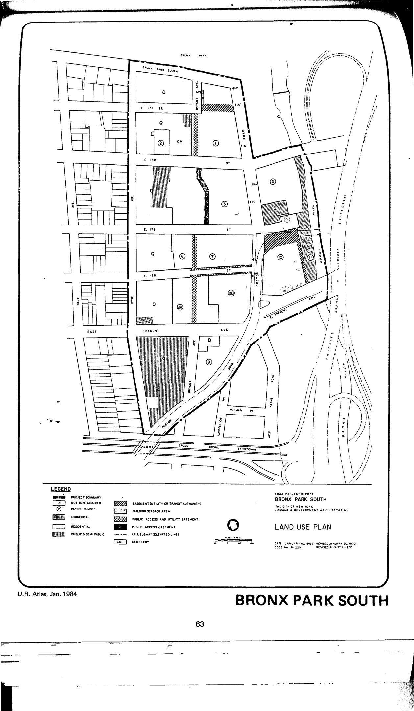

<!----->

The Bronx Park South plan was adopted in 1965, revised in 1989, and revised again in 1998. HPD has made the 1989 revision available to our team but not the most recent revision. The plan is still active. Uses for lots in the plan area include residential, commercial retail and service establishments, community facilities, and a public park.

NYC Housing and Development Administration, Bronx Park South Urban Renewal Plan (1989) rev. 2, minor change 1, adopted 1965. See [References](http://www.urbanreviewer.org/#page=references.html).