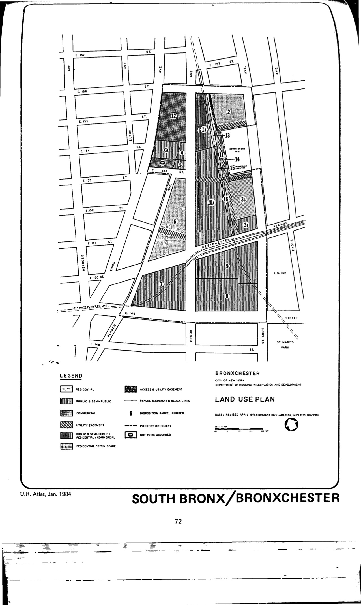

<!----->

The Bronxchester plan is a spin-off of the South Bronx urban renewal area and was adopted in 1989, last revised in 2008, and expires in 2015. The plan includes residential, commercial, open space, and public and semi-public uses.