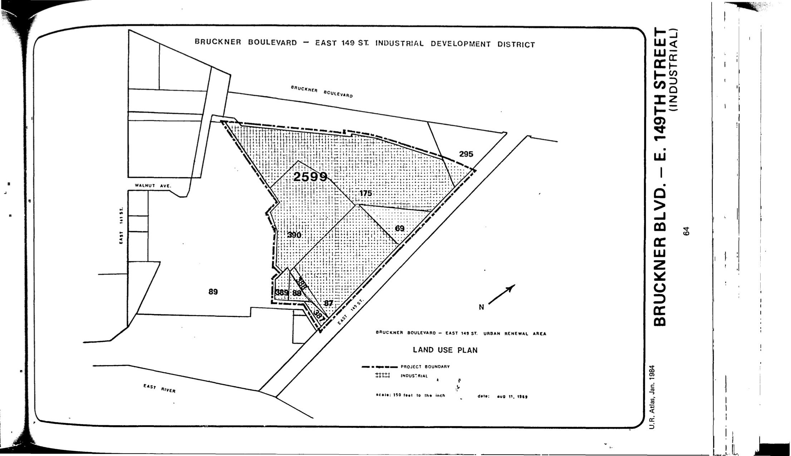

The Bruckner Boulevard–East 149th Street plan is a single-lot plan that was adopted in 1969, last revised in 1996, and expired in 2009. The lot is planned for industrial and manufacturing uses that "conform to the performance standards governing M1 Light Manufacturing Districts."

[NYC Housing Preservation and Development, Bruckner Boulevard-East 149th Street Urban Renewal Area Plan, Rev. 1 (1997).](https://www.nyc.gov/assets/hpd/downloads/pdfs/services/bruckner-boulevard-east-149th-street-first-amneded-urp.pdf)
