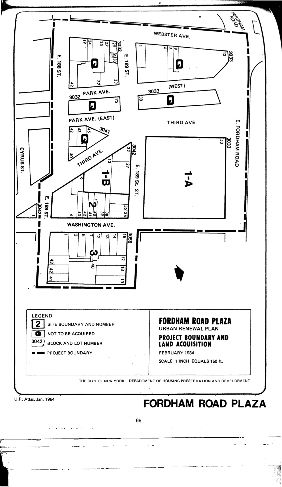

The Fordham Road Plaza plan was adopted in 1973, last revised in 1984, and expires in 2024. It calls for a post office with public and semi-public areas, commercial-retail establishments, a department store, a public parking garage, and government, professional, and business offices in the plan area.

[NYC Housing Preservation and Development, Fordham Road Plaza Third Amended Urban Renewal Plan (1984).](https://www.nyc.gov/assets/hpd/downloads/pdfs/services/fordham-road-third-amended-plaza-urp.pdf)
