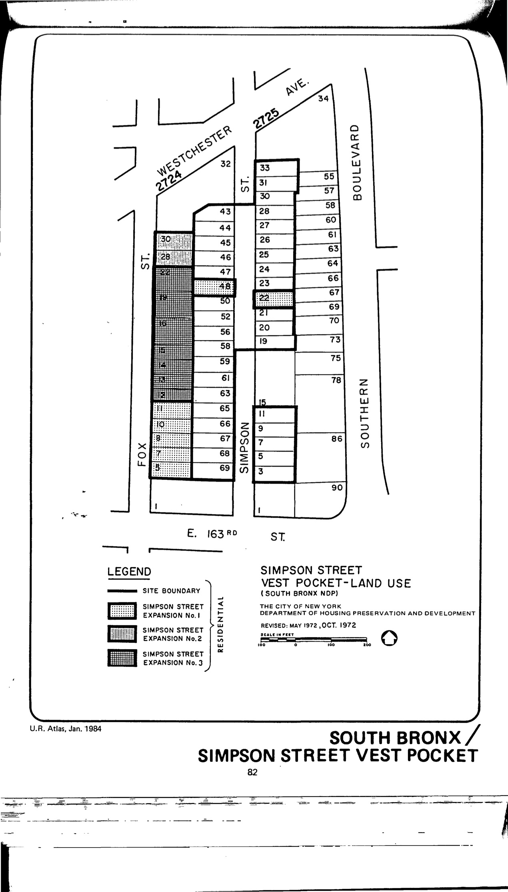

The Hunts Point North plan was adopted in 1994 and will expire in 2034. The site is a spin-off of the South Bronx urban renewal area and is designated for residential use.

[NYC Housing Preservation and Development, Hunts Point North Urban Renewal Plan (1993).](https://www.nyc.gov/assets/hpd/downloads/pdfs/services/hunts-point-north-urp.pdf)
