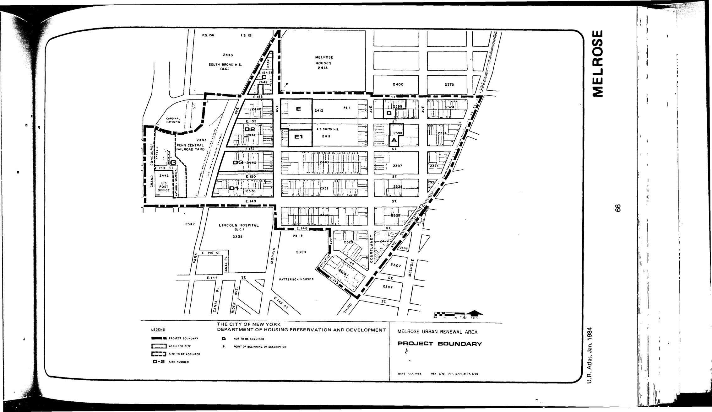

The Melrose plan was adopted in 1977, last revised in 2004, and expires in 2017. It delineates residential, public, and semi-public uses for lots in the plan area.

Susanne Schindler reviewed one building in the Renewal Area and placed in it context in The Avery Review 7 (April 2015), [A Belated Reveiw of Melrose D-1](http://averyreview.com/issues/7/melrose-d-1):

"The recent exhibition “Reviewing Renewal” (organized by the advocacy group 596 Acres at the Queens Museum) and the accompanying website urbanreviewer.org make one thing quite clear: In New York City, urban renewal is not a distant, pre–Jane Jacobs reality, but a current planning and development tool. Urban renewal areas are still being created to encourage investment and cohesive development, but—counter to the evil narrative—their goals can be changed over the course of their active life, which is set by New York City law as forty years... We need to see, and judge, history as if it were contemporary. After all, we don’t have a choice: The buildings exist and we need them. With very few exceptions, postwar low- or moderate-income housing developments in New York have not been demolished." 

[NYC Housing Preservation and Development, Melrose Fourth Amended Urban Renewal Plan (2004).](https://www.nyc.gov/assets/hpd/downloads/pdfs/services/melrose-fourth-amended-urp.pdf)
