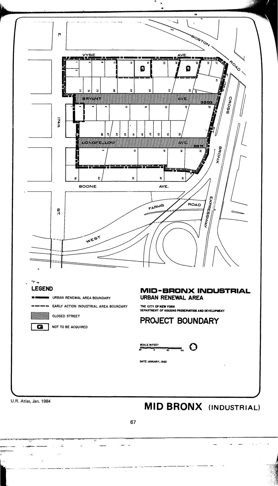

The Mid-Bronx plan was adopted in 1982, last revised in 1998, and expires in 2022. It demarcates residential and public open space areas for lots in the plan area.

See [References](http://www.urbanreviewer.org/#page=references.html). 
