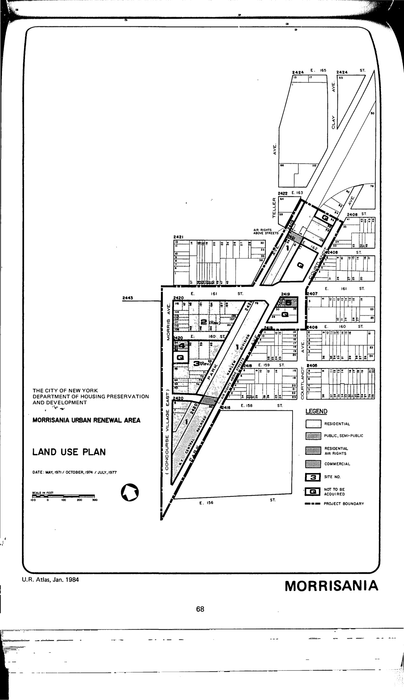

The Morrisania plan was adopted in 1971, last revised in 1994, and expired in 2007. It outlines residential, community facility, and open space uses for lots in the plan area.

See [References](http://www.urbanreviewer.org/#page=references.html). 
