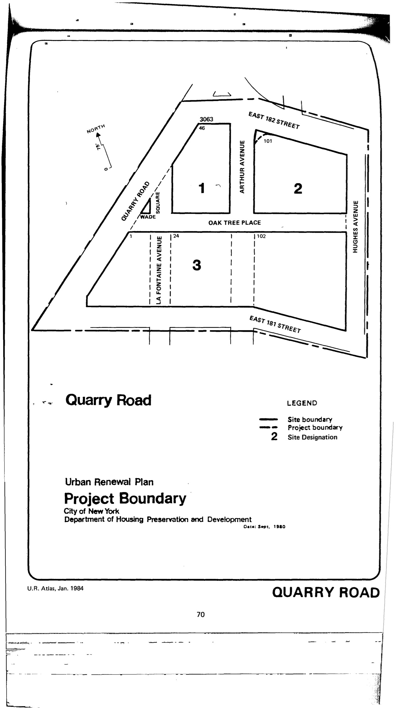

The Quarry Road plan was adopted in 1981, last revised in 1992, and expires in 2021. It calls for low-, moderate-, and middle-income housing with insitutional and recreational uses.

[NYC Housing Preservation and Development, Quarry Road Urban Renewal Area Plan (1981).](https://www.nyc.gov/assets/hpd/downloads/pdfs/services/quarry-road-urp.pdf)
