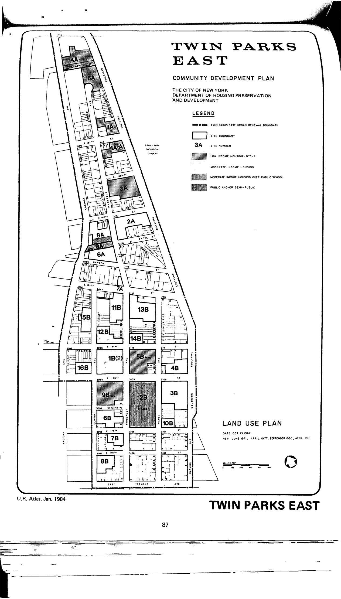

The Twin Parks East plan was adopted in 1967, last revised in 1990, and expired in 2007. It demarcates low- and moderate-income housing, moderate-income housing over a public school, public and/or semi-public space (including schools, parks, and open space), and commercial uses for lots in the plan area.

Susanne Schindler and Juliette Spertus wrote a great look back at the project in 2013 in Urban Omnibus "[The Landscape of Housing: Twin Parks Northwest 40 Years On](http://urbanomnibus.net/2013/11/the-landscape-of-housing-twin-parks-northwest-40-years-on/)."

See [References](http://www.urbanreviewer.org/#page=references.html).