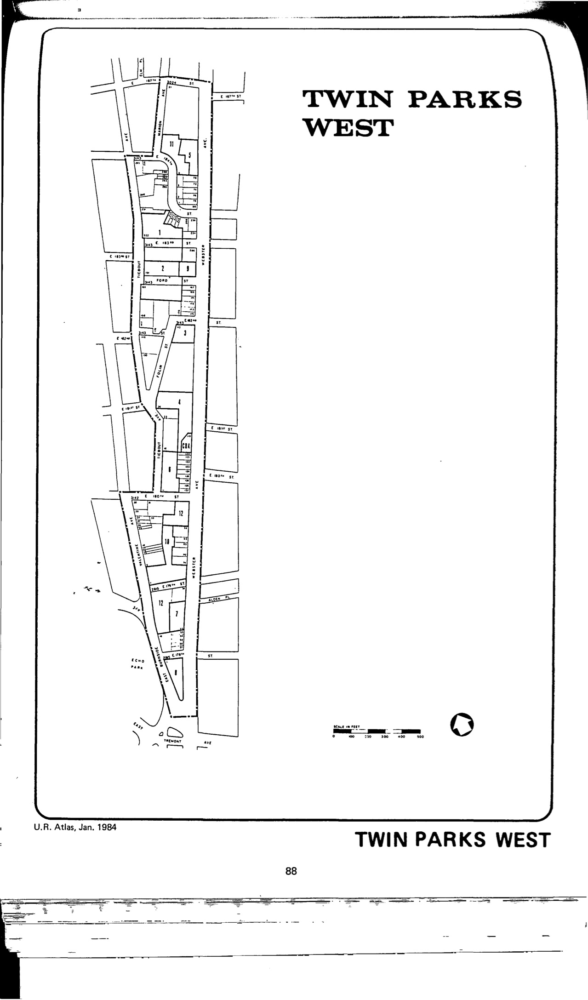

The Twin Parks West plan was adopted in 1967, last revised in 1972, and expired in 2007. It calls for rehabilitation and redevelopment in support of the existing residential character of the general neighborhood.

Susanne Schindler and Juliette Spertus wrote a great look back at the project in 2013 in Urban Omnibus "[The Landscape of Housing: Twin Parks Northwest 40 Years On](http://urbanomnibus.net/2013/11/the-landscape-of-housing-twin-parks-northwest-40-years-on/)."

[NYC Housing Preservation and Development, Twin Parks West Second Amended Urban Renewal Area Plan, Minor Change (1972).](https://www.nyc.gov/assets/hpd/downloads/pdfs/services/twin-parks-west-second-amended-urp-first-minor-change.pdf)
