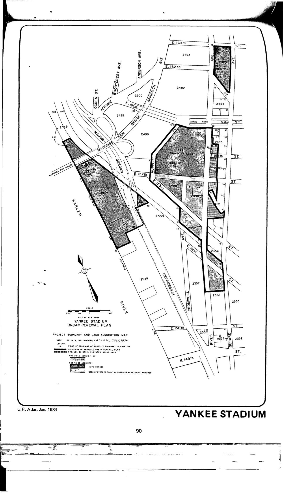

The Yankee Stadium plan was adopted in 1973, last revised in 1974, and expired in 2013. It provides for upgrading and redevelopment in support of Yankee Stadium to include commercial use, more parking, improved traffic flow, and improvements to the local subway.

[NYC Housing Preservation and Development, Yankee Stadium Second Amended Urban Renewal Area Plan (1974).]
(https://www.nyc.gov/assets/hpd/downloads/pdfs/services/yankee-stadium-second-amended-urp.pdf)
