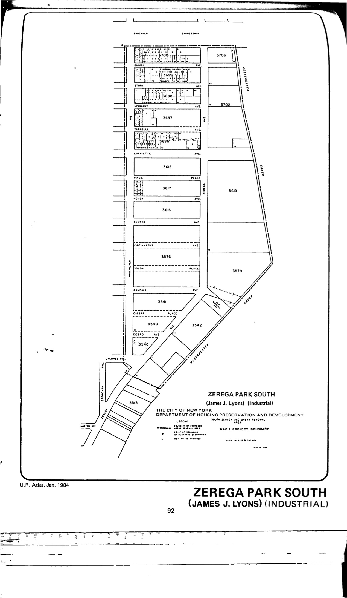

The Zerega Park South (James J. Lyons) plan for the South Zerega Avenue urban
renewal area was adopted in 1970, last revised in 2007, and updated in 2010. It
primarily calls for industrial use, with 10% of the industrial lots to be
landscaped open space, and limited residential use.

