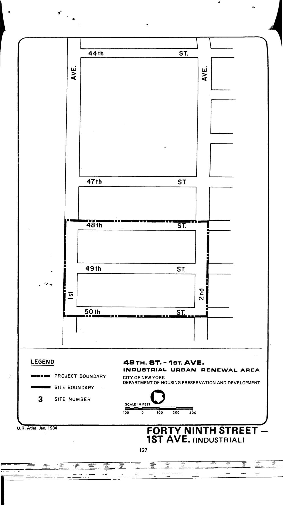

The 49th Street–1st Avenue plan was adopted in approximately 1972 and expired in approximately 2012. It designates the plan area for industrial use. HPD does [not have complete records](https://www.nyc.gov/site/hpd/services-and-information/urban-renewal-details.page?areaId=106) of this plan.
