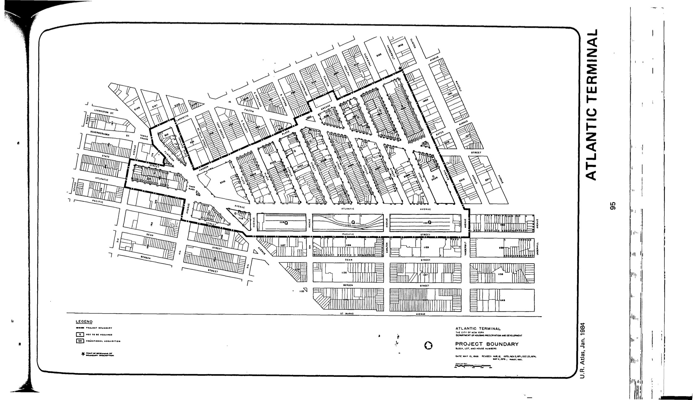

<!---

-->

The Atlantic Terminal plan was adopted in 1968, last revised in 2004, and expires in 2044, with the exception of some sites that expired in 2008. It intends to rehabilitate substandard or insanitary structures, encourage development and employment opportunities in the area, provide high quality housing, and provide community facilities including parks, retail shopping, and parking.

NYC Housing Preservation and Development, Atlantic Terminal Urban Renewal Plan (2004), rev. 10, adopted 1968. See [References](http://www.urbanreviewer.org/#page=references.html).

For a history of the plan as it has evolved, see [Norman Oder, Behind the "empty railyards": 40 years of ATURA, Baruch's plan, and the city's diffidence (March 17, 2006).](http://atlanticyardsreport.blogspot.com/2006/03/behind-empty-railyards-40-years-of.html)
