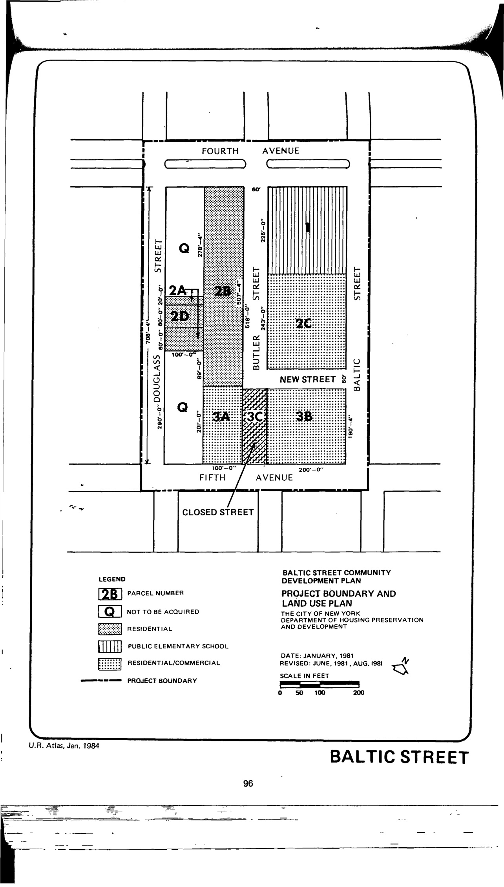

The Baltic Street plan was adopted in 1982 and expires in 2022. It permits residential, community facility, and commercial uses for lots in the plan area.

NYC Housing Preservation and Development, Baltic Street Community Development Plan (1981) rev. 1, adopted 1982. See [References](http://www.urbanreviewer.org/#page=references.html).