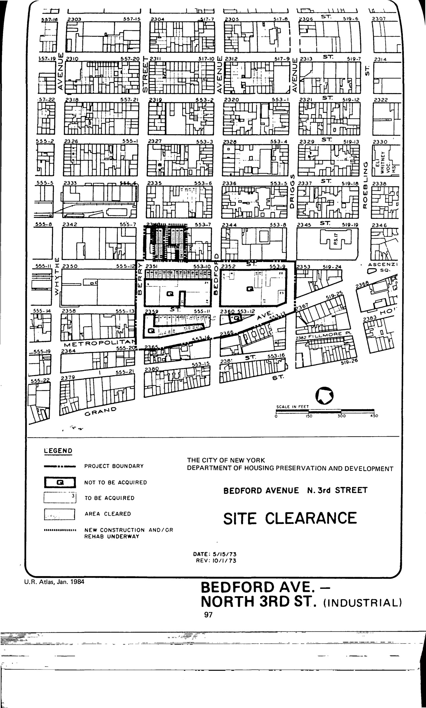

The Bedford Avenue–North 3rd Street plan was adopted in 1969, last revised in 1985, and expired in 2009. Its intent is to create a mixed-use area with residential, industrial, and public open space uses.

NYC Housing Preservation and Development, [Bedford Avenue–North 3rd Street Urban Renewal Plan (1985) rev. 3, adopted 1969]([url](https://www.nyc.gov/assets/hpd/downloads/pdfs/services/bedford-avenue-north-third-street-third-amended-urp.pdf)https://www.nyc.gov/assets/hpd/downloads/pdfs/services/bedford-avenue-north-third-street-third-amended-urp.pdf). 
