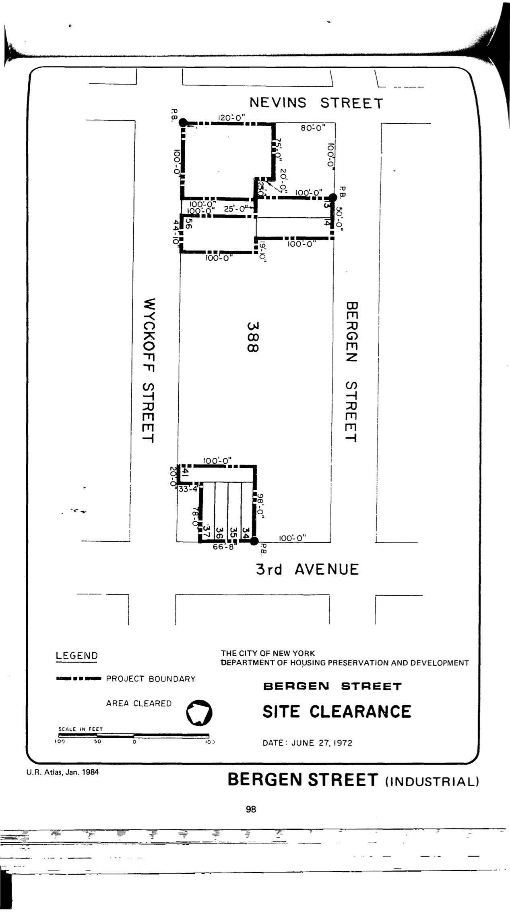

The Bergen Street plan was adopted in approximately 1972, last revised in 1989, and expired in approximately 2011. It designates lots in the plan area for industrial use. HPD has not yet made the plan available to our team.

[Housing Preservation and Development, Bergen Street Industrial (1971).](https://www.nyc.gov/assets/hpd/downloads/pdfs/services/bergen-street-urp.pdf) Note that because HPD did not make this document avialable to the Urban Reviewer Team in 2014, we have not yet captured information about planned uses for particular properties here.
