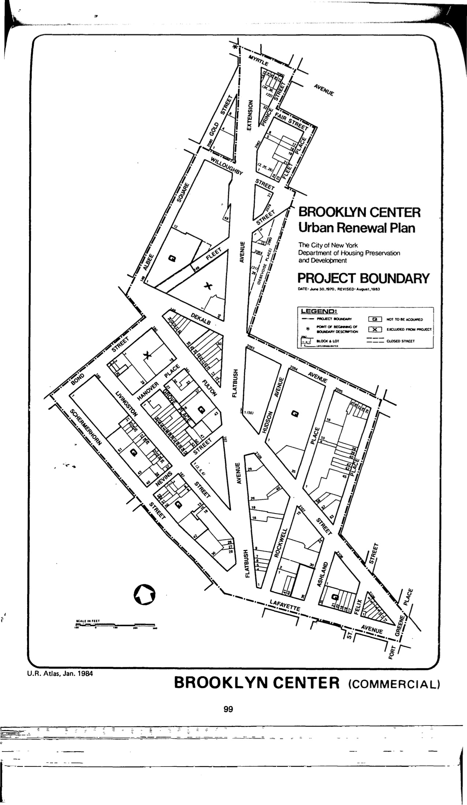

The Brooklyn Center plan was adopted in 1970, last revised in 2004, and expires in 2044, with the exception of some sites that expired in 2010. It designates lots in the plan area for commercial use.

See [References.](http://www.urbanreviewer.org/#page=references.html)
