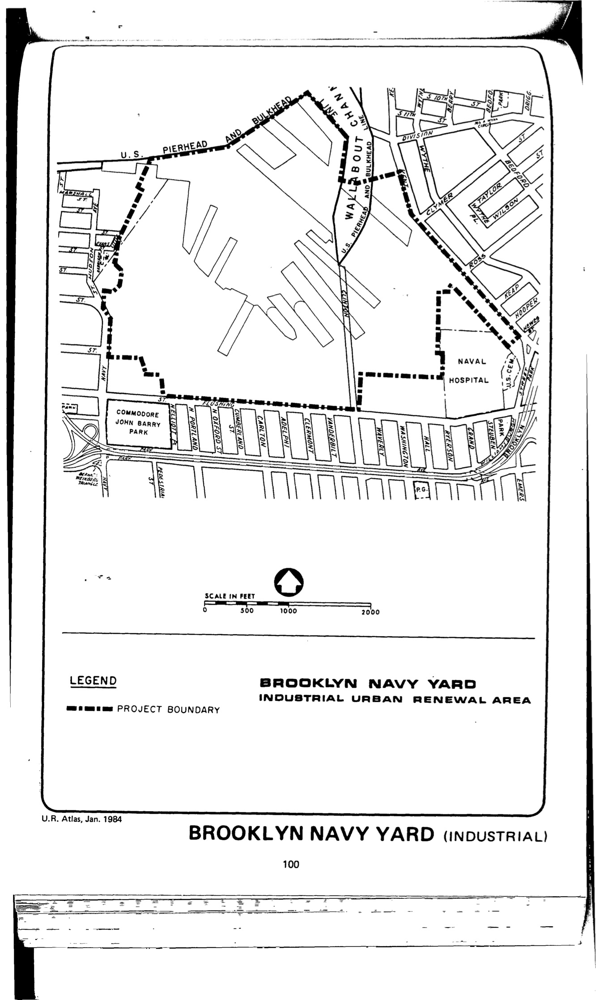

The Brooklyn Navy Yard plan was adopted in 1971 and expired in approximately 2011. Its stated objective is to promote the "creation of a modern industrial district which will: retain and attract manufacturers to the City; create 15,000 jobs upon completion; provide relocation resource for firms displaced by other urban renewal projects."

[NYC Housing Preservation and Development, Brooklyn Navy Yard Area Plan (1971).](https://www.nyc.gov/assets/hpd/downloads/pdfs/services/brooklyn-navy-yard-urp.pdf) 
