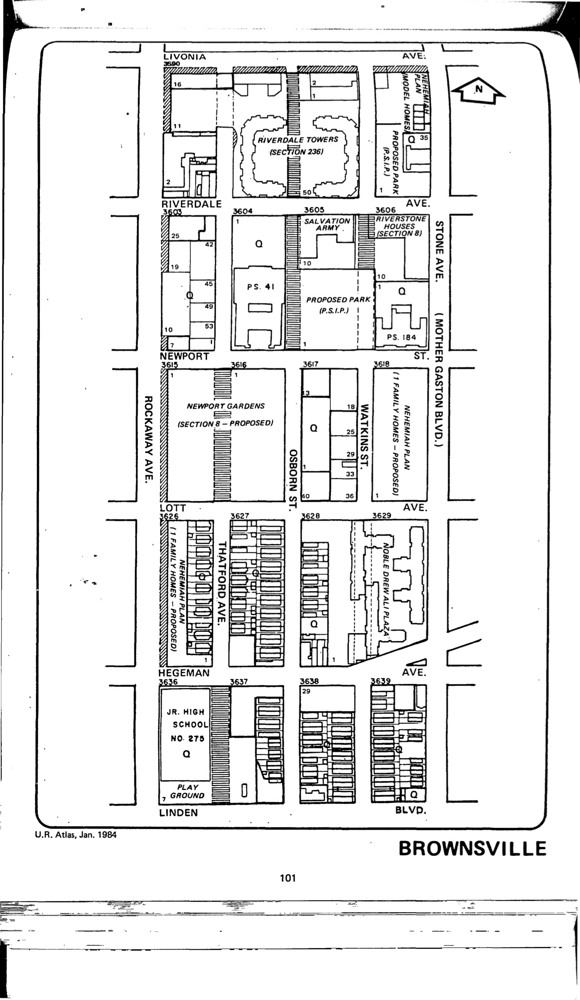

<!----->

The Brownsville I plan was adopted in 1967, last revised in 1995, and expired in 2007. It promotes residential uses with appurtenant recreational, community, and parking facilities; commercial uses limited to local retail and service establishments; manufacturing and expansion of existing industrial uses; and some street closings and openings.

Housing Preservation and Development, Brownsville I Urban Renewal Plan (1995) rev. 6, adopted 1967. See [References.](http://www.urbanreviewer.org/#page=references.html)