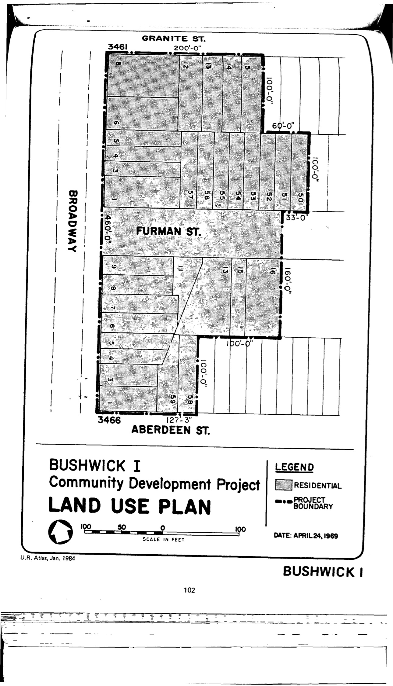

The Bushwick I plan was adopted in 1969 and expired in 2009. It intends to promote the construction of public housing for low-income families, community facilities, open space, and other amenities. It also calls for the modification of a street within the clearance area to limit access by vehicular traffic.

See [References](http://www.urbanreviewer.org/#page=references.html). 