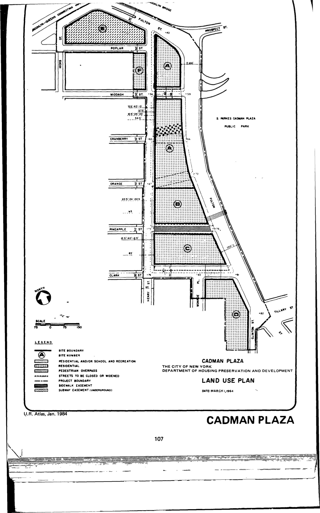

The Cadman Plaza plan was adopted in 1962, last revised in 1979, and expired in 2002. It promotes uses including residential (either rehabilitated or cleared and redeveloped), retail commercial, recreational areas, parking garages, and street widenings for the plan area.

See [References](http://www.urbanreviewer.org/#page=references.html). 