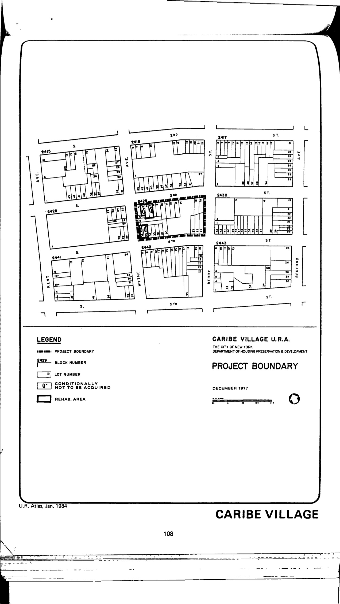

The Caribe Village plan was adopted in 1978 and expired in 2018. It promotes a low-rise, low-density residential area.

[NYC Housing Preservation and Development, Caribe Village Urban Renewal Plan (1978).](https://www.nyc.gov/assets/hpd/downloads/pdfs/services/caribe-village-urp.pdf)
