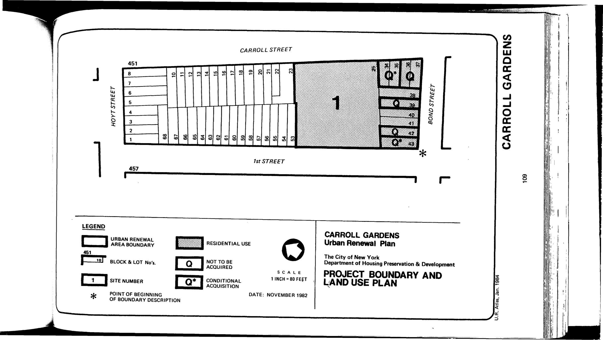

The Carroll Gardens plan was adopted in 1983 and expires in 2023. It includes housing for low- and moderate-income senior citizens, accessory uses (such as off-street parking, community rooms, and play areas), and appurtenant community facilities.

[NYC Housing Preservation and Development, Carroll Gardens Urban Renewal Plan (1983).](https://www.nyc.gov/assets/hpd/downloads/pdfs/services/carroll-gardens-urp.pdf)
