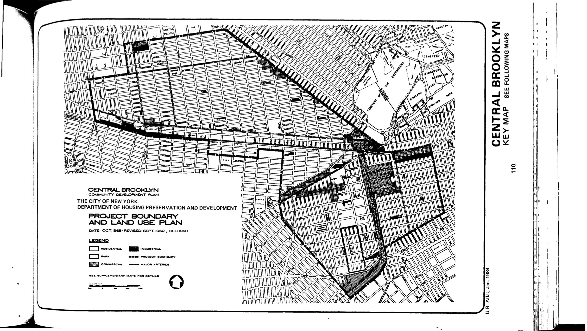
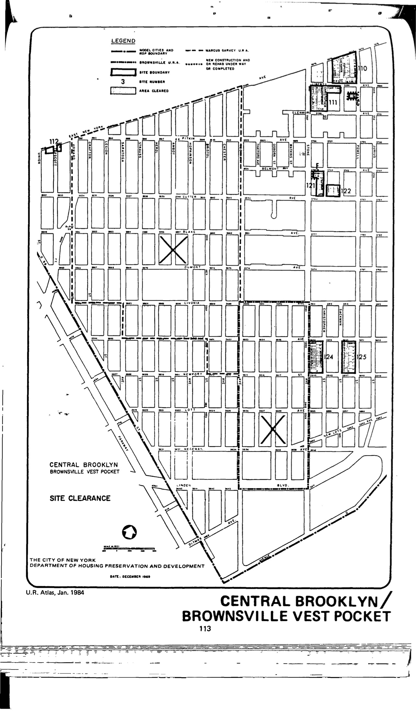
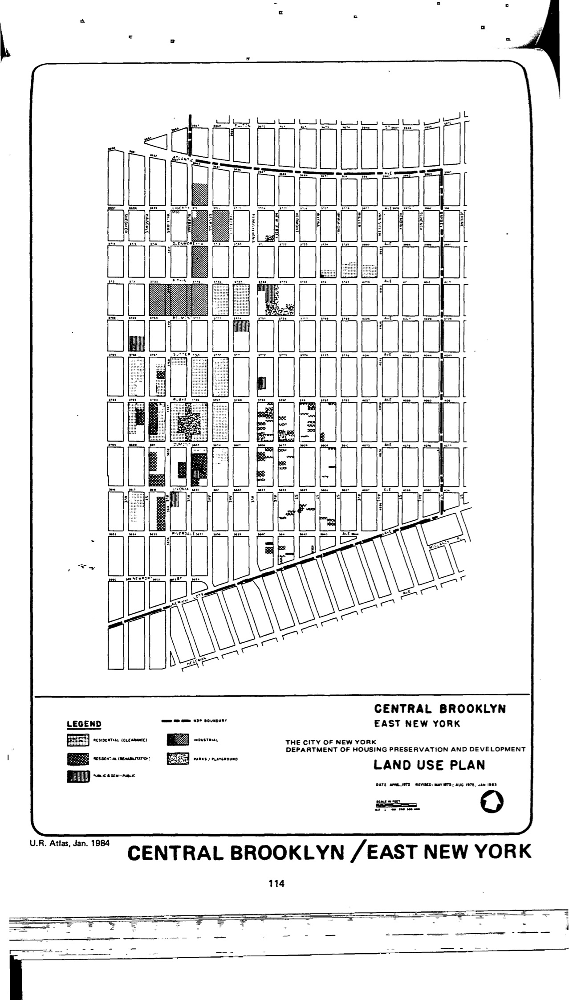
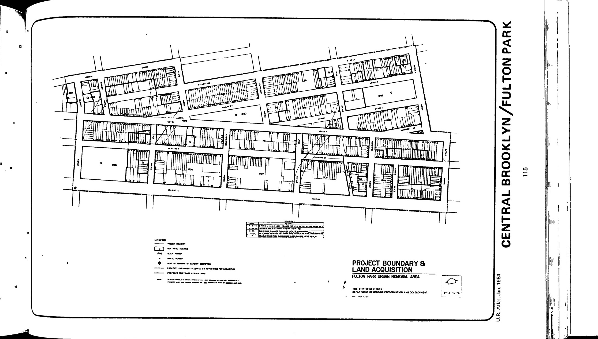

.jpg)
.jpg)

The Central Brooklyn plan was adopted in 1968, last revised in 1983, and expired in 2008. Planned uses include residential (varying densities developed through both rehabilitation and clearance), commercial, parks and playgrounds, public and quasi-public, and light manufacturing.

See [References](http://www.urbanreviewer.org/#page=references.html). 