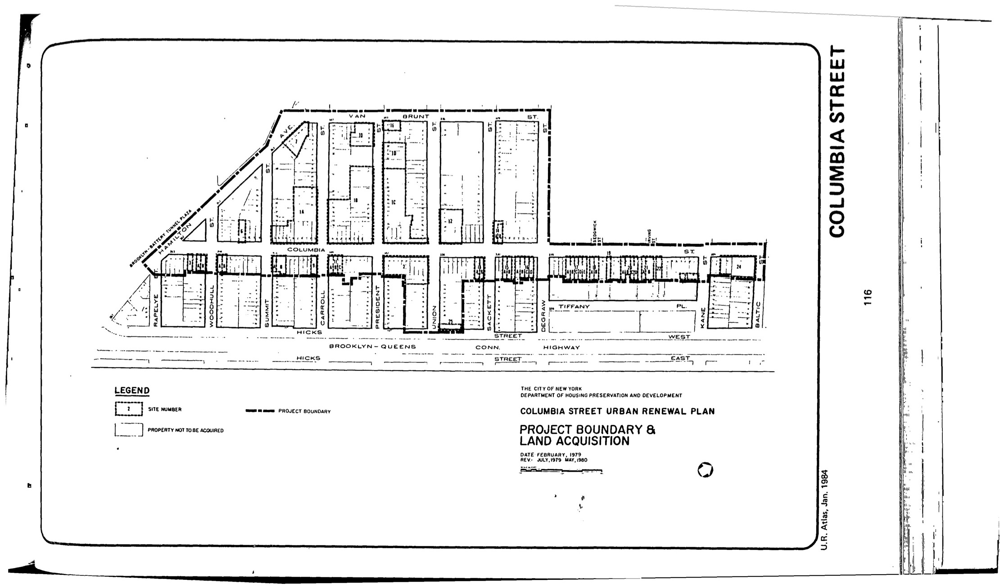

The Columbia Street plan was adopted in 1979, last revised in 1992, and expires in 2019. It includes residential, commercial, industrial, and park uses for lots in the plan area. The lots on the northeast corner of the intersection of Van Brunt Street and President Street are to be used for a park.

You can [read the plan](https://drive.google.com/file/d/1xnoVPC0A8Qd63fROy6PR4j2106MG0zyq/view?usp=sharing) (the document was made available by NYC HPD as it nears its expiration as a result of [a law enacted in 2017 requiring such disclosure](https://www.boweryboogie.com/2017/12/city-council-passes-bill-increased-urban-renewal-transparency/)). It expires on 9/13/2019.

See [References](http://www.urbanreviewer.org/#page=references.html).
