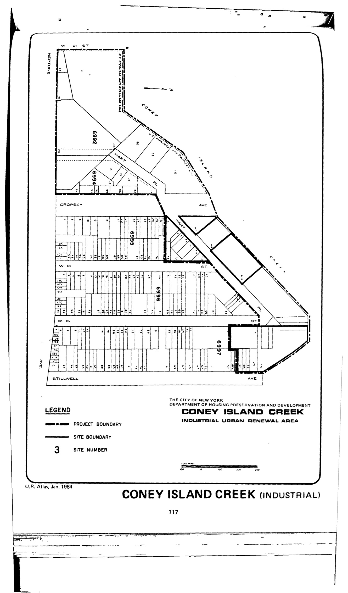

The Coney Island Creek plan was adopted in 1970 and expired in 2008. It proposes to "conform the structures, size of parcels, and parking and loading facilities to industrial zoning."

See [References](http://www.urbanreviewer.org/#page=references.html).