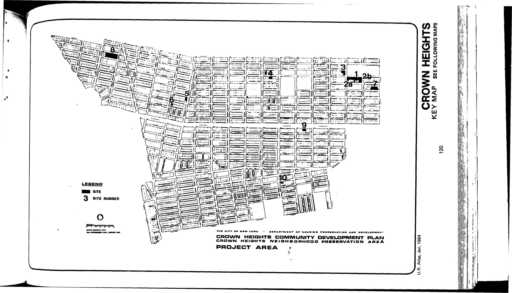
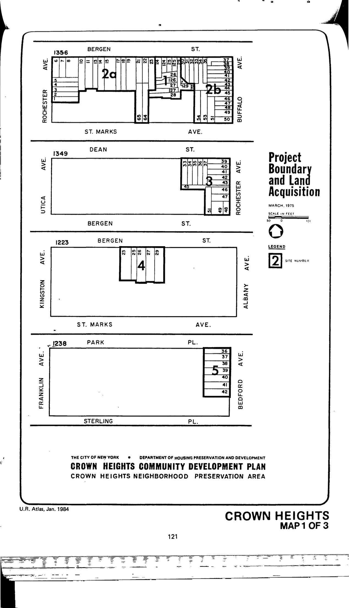
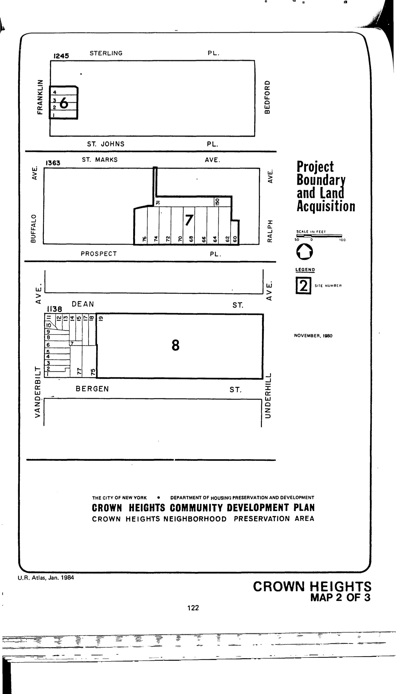
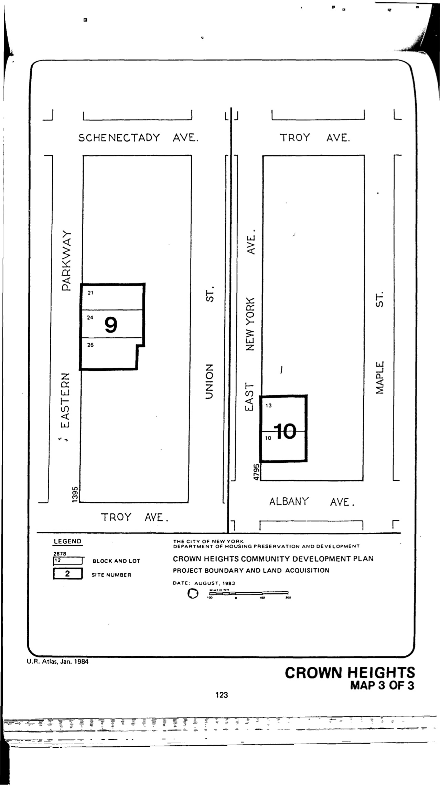

The Crown Heights plan was adopted in 1976, last revised in 2002, and expires in 2016. It includes residential, community facility, and accessory parking uses for lots in the plan area.

See [References](http://www.urbanreviewer.org/#page=references.html).
