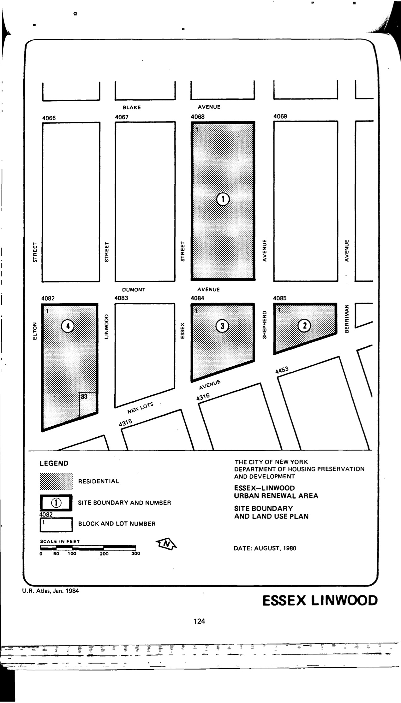

The Essex–Linwood plan was adopted in 1981, last revised in 1986, and expires in 2021. It calls for residential and community facilities in the plan area.

[NYC Housing Preservation and Development, Eassex-Linwood First Amended Urban Renewal Area Plan (1986).](https://www.nyc.gov/assets/hpd/downloads/pdfs/services/essex-lindwood-first-amended-urp.pdf)
