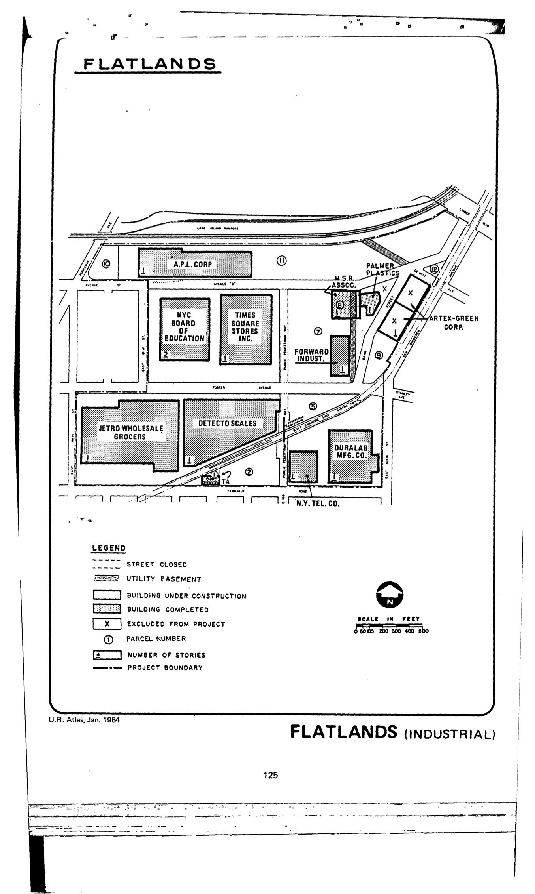

<!---

-->
 

The Flatlands plan was adopted in 1961, last revised in 1991, and expired in 2001. It calls for public service, convenience retail and service, research and testing, storage and distribution, and high-performance manufacturing uses for lots in the plan area.

See [References](http://www.urbanreviewer.org/#page=references.html).
