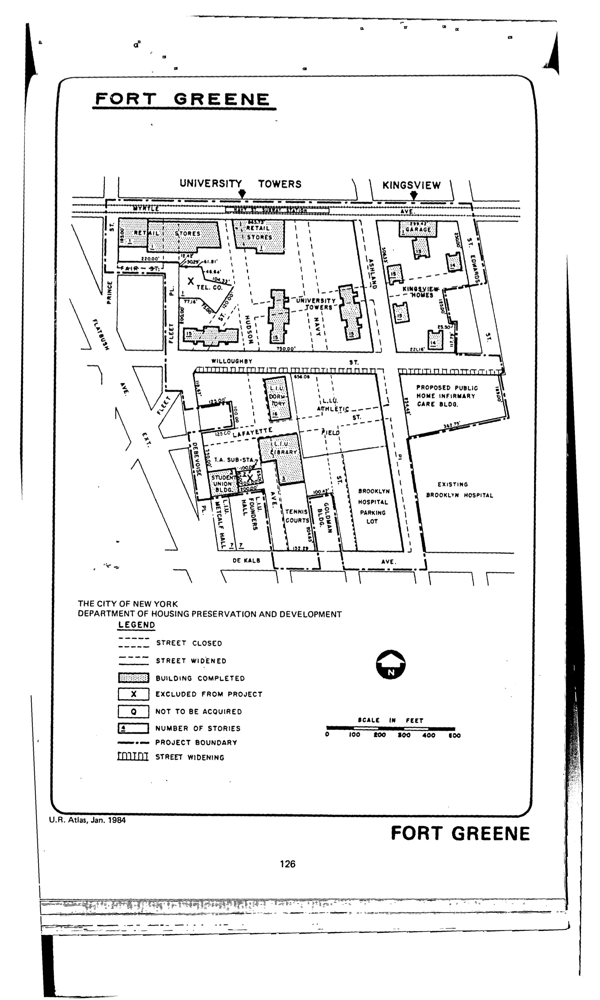

The Fort Greene plan was adopted in 1952, last revised in 1973, and expired in 1992. It outlines residential, recreational, parking and community facilities, medical facilities, institutional facilities (both educational and hospital-related), and hospital-residential uses for lots in the plan area.

See [References](http://www.urbanreviewer.org/#page=references.html).
