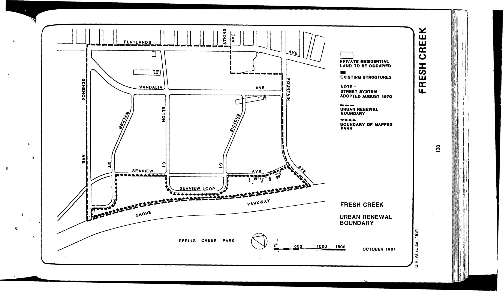

<!----->

The Fresh Creek plan was adopted in 1967, last revised in 2008, and expires in 2036. It designates residential, local and regional commercial, park, landscape buffer, school, and public and semi-public uses for lots in the plan area.

See [References](http://www.urbanreviewer.org/#page=references.html).