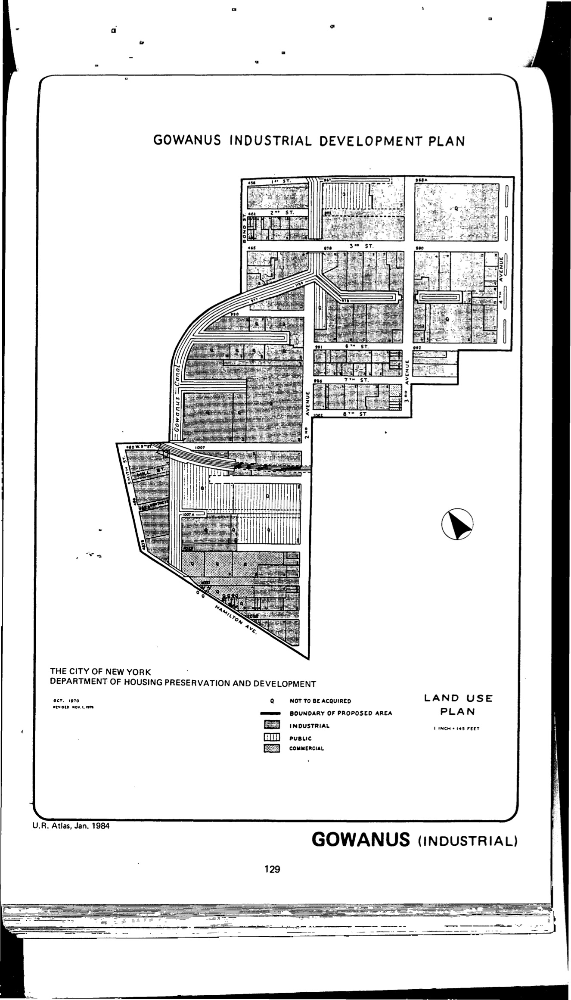

The Gowanus plan was adopted in 1971, last revised in 1976, and expired in 2011. It designates lots in the plan area for industrial use, including all high-performance manufacturing and accessory uses. Its "[p]urpose is to revitalise industrial character and eliminate impediments to land disposition and development, and create job opportuniities in high job deficit area."

[NYC Housing Preservation and Development, Gowanus Industrial Development Project First Amended Urban Renewal Area Plan (1977).](https://www.nyc.gov/assets/hpd/downloads/pdfs/services/gowanus-first-amended-urp.pdf)
