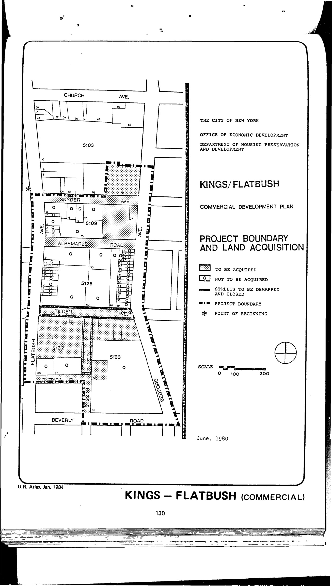

The Kings/Flatbush plan was adopted in 1984 and will expire in 2024. It assigns commercial and parking uses to lots in the plan area.

[NYC Housing Preservation and Development, Kings/Flatbush Commercial Development Project Urban Renewal Area Plan (1981).](https://www.nyc.gov/assets/hpd/downloads/pdfs/services/kings-flatbush-urp.pdf)
