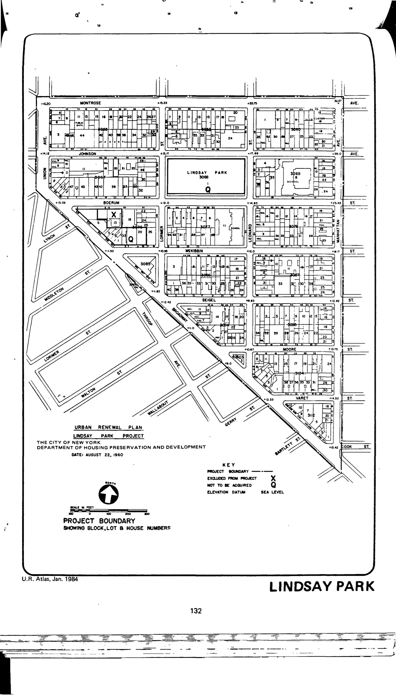

<!---->

The Lindsay Park plan was adopted in 1962 and expired in 2002. It concentrates on the development of moderate-income housing and community facilities as well as a playground, public school, and local retail commercial facilities in the plan area. HPD has not yet made the plan available to our team.

See [References](http://www.urbanreviewer.org/#page=references.html).