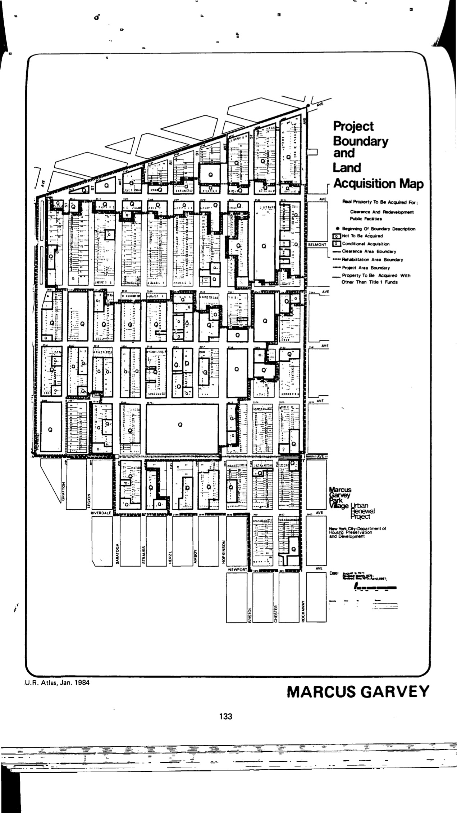

The Marcus Garvey Park Village plan was adopted in 1968, last revised in 1989, and expired in 2008. It calls for residential, commercial, public, semi-public, open space, and alternate uses in the plan area.

See [References](http://www.urbanreviewer.org/#page=references.html).