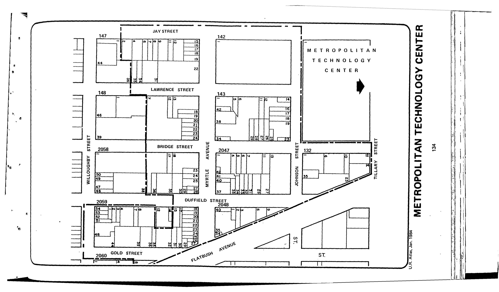

The Metropolitan Technology Center plan was adopted in 1987, last revised in 2003, and expires in 2027. It outlines institutional, commercial, and open space uses for lots in the plan area along with street widenings.

[NYC Housing Preservation and Development, etropolitan Technology Center Second Amended Urban Renewal Area Plan (2004).](https://www.nyc.gov/assets/hpd/downloads/pdfs/services/metropolitan-technology-center-second-amended-urp.pdf)
