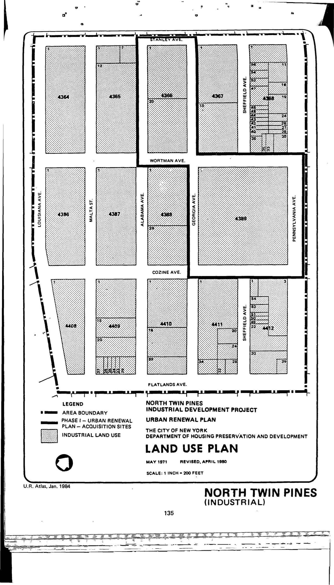

The North Twin Pines plan was adopted in 1971 and expired in 2001. It designates lots in the plan area for industrial use. HPD has not yet made the plan available to our team or [on its website](https://www.nyc.gov/site/hpd/services-and-information/urban-renewal-details.page?areaId=120).
