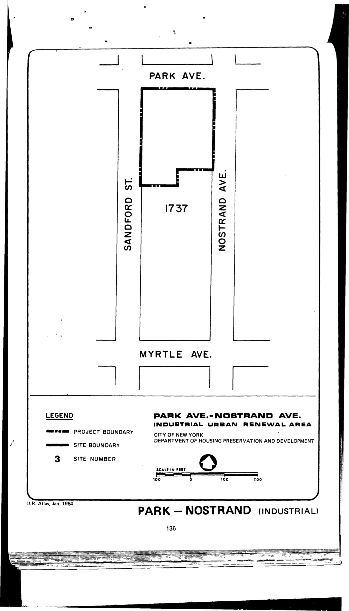

The Park Avenue–Nostrand Avenue plan was adopted in 1970 and expired in 2010. It designates the plan area for industrial use.

[NYC Housing Preservation and Development, Park Avenue-Nostrand Avenue Urban Renewal Area Plan (1970).](https://www.nyc.gov/assets/hpd/downloads/pdfs/services/park-avenue-nostrand-avenue-urp.pdf)
