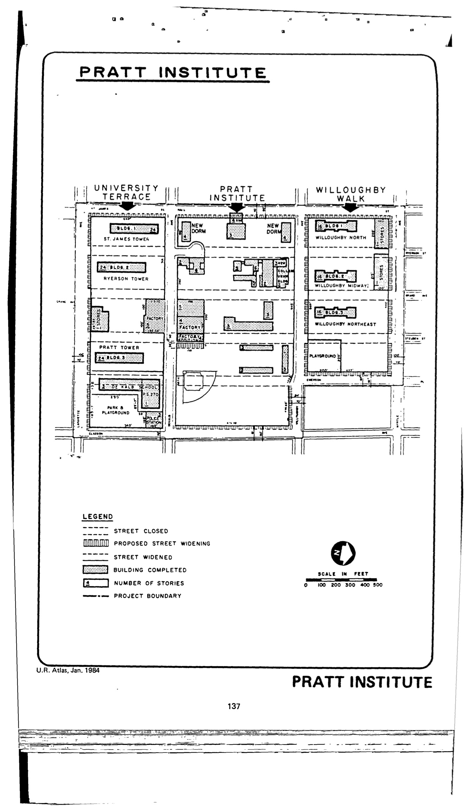

<!----->

The Pratt Institute plan was adopted in 1954, last revised in 1980, and expired in 1994. It calls for residential, public playground, retail, manufacturing, private and public educational, and public and institutional uses for the area on and around the Pratt Institute campus.

See [References](http://www.urbanreviewer.org/#page=references.html).
