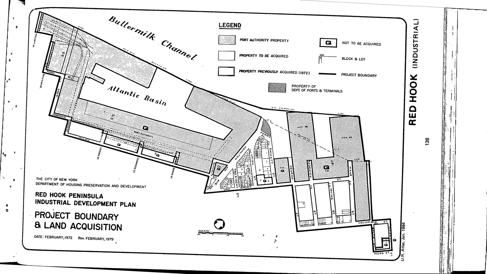

The Red Hook Peninsula plan was adopted in 1972, last revised in 1988, and expired in 2012. It designates lots in the plan area for maritime industrial use.

[NYC Housing Preservation and Development, Red Hook Peninsula Third Amended Urban Renewal Area Plan (1991).](https://www.nyc.gov/assets/hpd/downloads/pdfs/services/red-hook-peninsula-third-amended-urp.pdf)
