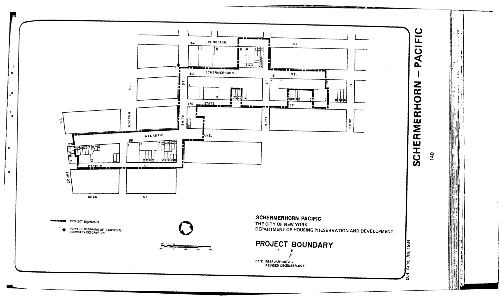

The Schermerhorn–Pacific plan was adopted in 1976 and expires in 2016. It calls for commercial and residential uses including the provision of integrated low-, moderate-, and middle-income housing. 
