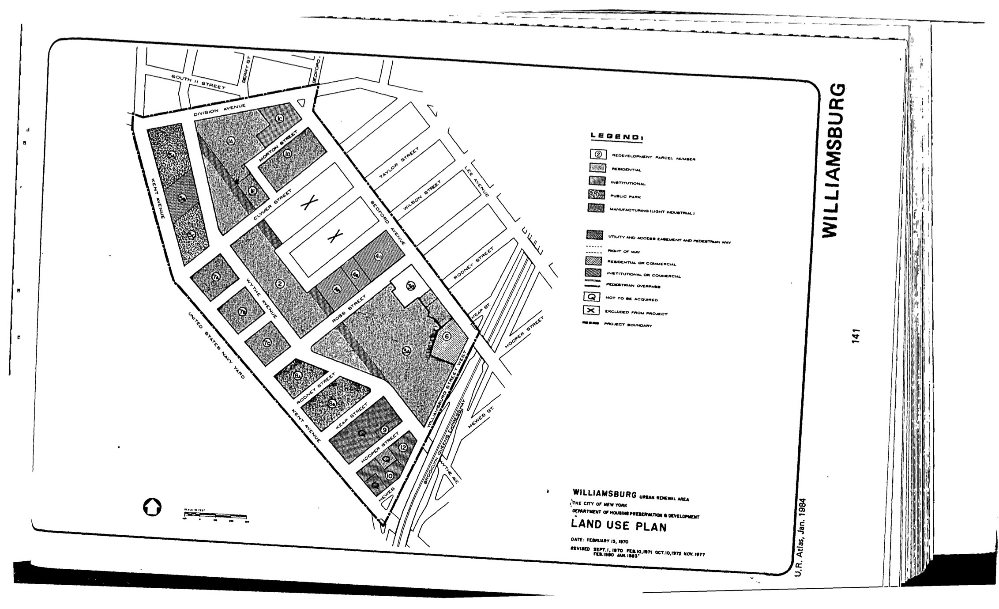

<!----->

The Williamsburg I plan was adopted in 1967, last revised in 1999, and expired in 2007. It provides for comprehensive redevelopment of the plan area, including new and some rehabilitated residential, commercial, institutional, parks, and open space uses.

See [References](http://www.urbanreviewer.org/#page=references.html).