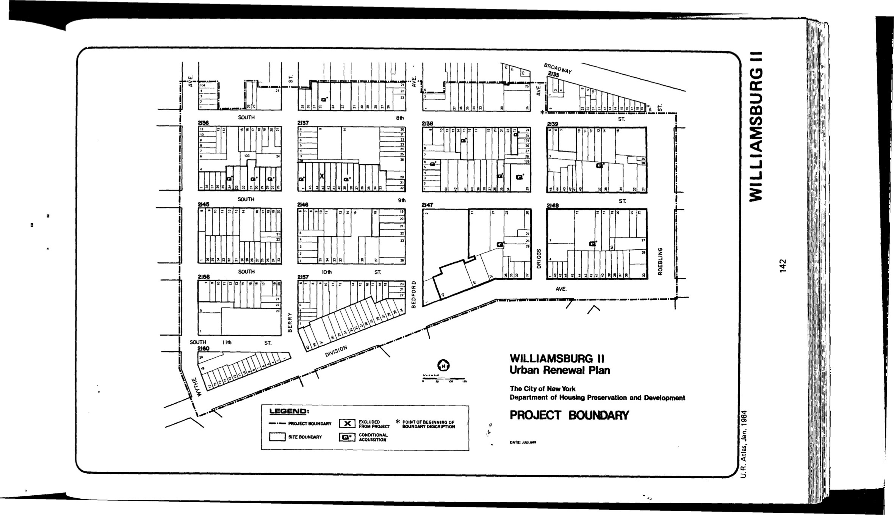

The Williamsburg II plan was adopted in 1984, last revised in 1989, and will expire in 2024. It designates residential and park uses for lots in the plan area.

[NYC Housing Preservation and Development, Williamsburg II Urban Renewal Area Plan, Minor Change (2013).](https://www.nyc.gov/assets/hpd/downloads/pdfs/services/williamsburg-ii-urp-third-minor-change.pdf)
