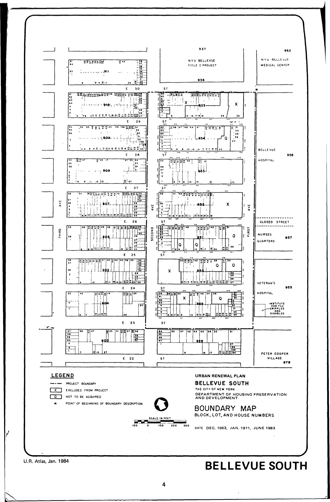

The Bellevue South plan was adopted in 1964 and expired in 2004. Its intention is to promote residental, public, and semi-public uses and public park space for lots in the plan area.

See [References](http://www.urbanreviewer.org/#page=references.html).