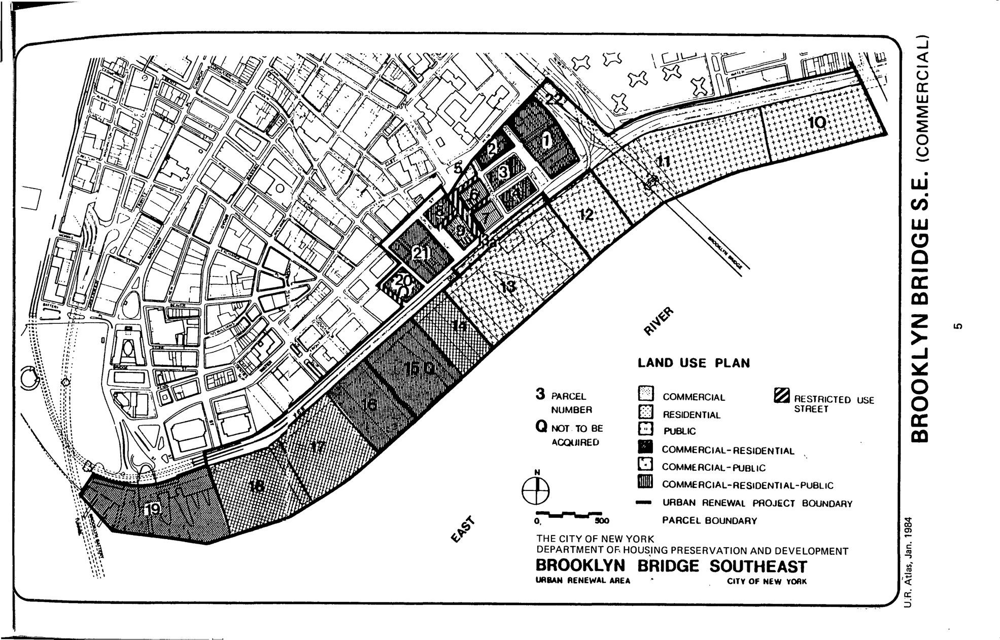

The Brooklyn Bridge Southeast plan was adopted in 1969, last revised in 1998, and expires in 2068. It promotes commercial-public uses including commercial development compatible with the theme and concept of the South Street Seaport, parks, pedestrian thoroughfares, open space, institutional, and accessory uses.

[NYC Housing Preservation and Development, Brooklyn Bridge Southeast Eighth Amended Urban Renewal Area Plan (1998)](https://www.nyc.gov/assets/hpd/downloads/pdfs/services/brooklyn-bridge-southeast-eighth-amended-urp.pdf).
